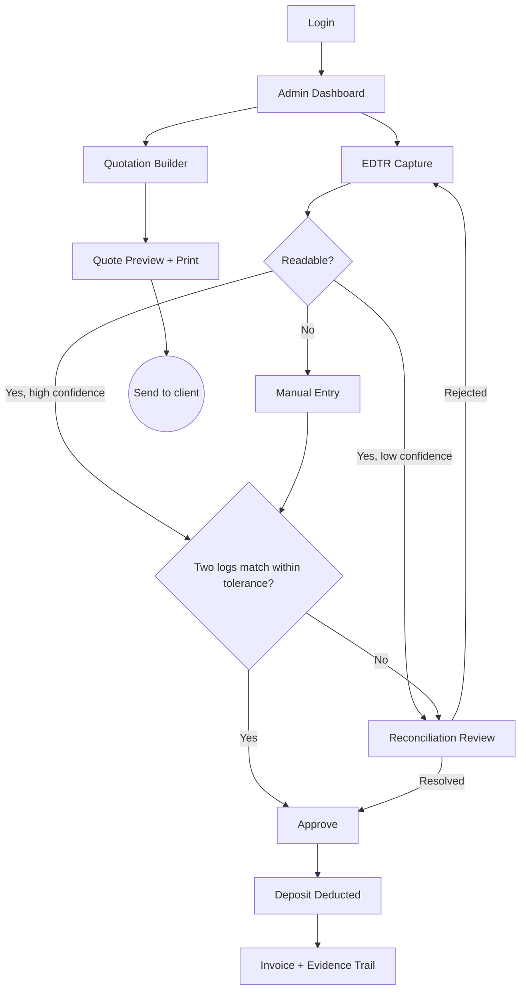

# Product Requirements Document (PRD)

**Project:** ArkiLaunch (Web-Based Construction Equipment Rental Management System)
**Date:** 2026-07-25
**Version:** 0.1
**Owner:** ArkiLaunch Team (Almara Construction capstone)
**Status:** Locked
**Last reconciled:** 2026-08-01 (see docs/index.md §1); §8 amended 2026-08-20 by `docs/cr-arkilaunch-open-meteo-free-tier.md`
**BRD:** [brd-arkilaunch.md](brd-arkilaunch.md)

---

> **Note:** This PRD defines *what* ArkiLaunch builds and for whom. Architecture (the *how*) lives in the SDD. Cross-links: source idea [idea-arkilaunch.md](idea-arkilaunch.md); business case [brd-arkilaunch.md](brd-arkilaunch.md); verified claims and carried gaps [scrutiny-arkilaunch.md](scrutiny-arkilaunch.md). Feature IDs (`PRD-F1`..`PRD-F8`) are frozen here and never renumbered; downstream SDD, RFC, QAD, SAD, CLR, and AIA all trace back to them.

---

## 1. Product Purpose & Value Proposition

ArkiLaunch is a multi-tenant B2B SaaS that runs the back office for Philippine heavy-equipment rental MSMEs. It scans handwritten field time-sheets into a bill the administrator can trust, prices rentals in under a minute from live diesel and travel distance, and keeps a flood-proof digital record with weather-linked liability evidence. The buyer is the rental firm's back-office administrator, who today hand-calculates every quote and re-keys every paper Equipment Daily Time Report (EDTR) into Excel. What makes it different: it back-ends the paper instead of forcing a born-digital field workflow. It OCRs the existing handwritten EDTRs and reconciles them against a second independent log before any deposit is deducted, a billing-integrity guarantee no incumbent PH rental tool offers. Almara Construction Corporation in Quezon City is the pilot and anchor tenant; the same product then serves additional rental MSMEs.

---

## 2. Target Personas

Personas are referenced with they/them. No persona has a stated gender.

**Primary Persona; Rhea, the Administrator (anchor-tenant back office)**
- *Who they are:* The sole back-office administrator at Almara Construction. They own quoting, EDTR re-keying, invoicing, and physical filing. They are the daily champion and the buyer's proxy inside the tenant.
- *Their core frustration:* Everything is manual. A quote takes 20 to 30 minutes by hand. Every paper EDTR is re-keyed into Excel. A single flood can erase a week of billing evidence, so the firm eats the discrepancy against a client's prepaid deposit.
- *What success looks like for them:* "The field logs scan themselves into a bill I can trust, quotes go out in a minute, and a flood can't erase my records anymore."

**Secondary Persona; Rental Company Owner**
- *Who they are:* The economic sponsor. They want utilization and financial oversight, not day-to-day data entry.
- *Their core frustration:* No trustworthy, real-time view of fleet utilization or revenue leakage; reports are stitched together by hand from the admin's Excel.

**Secondary Persona; Field Timekeeper**
- *Who they are:* Records active and idle equipment hours on assigned project sites. Enters EDTRs directly on a phone where willing, or photographs the paper sheet. Uses 2FA and can only touch their assigned sites.
- *Their core frustration:* Paper sheets get lost, smudged, or delayed; they are chased by the admin for hours that should already be recorded.

**Secondary Persona; Customer / Contractor**
- *Who they are:* Rents equipment through a tenant's public portal. Browses the catalog, books, pays a deposit, tracks transaction status.
- *Their core frustration:* Existing PH rental sites answer a price request with a contact form emailed back hours later; there is no self-serve booking or transparent status.

**Secondary Persona; ArkiLaunch Platform Admin**
- *Who they are:* The ArkiLaunch team. Onboards new rental-company tenants, runs human-in-the-loop KYC confirmation, and manages subscriptions.
- *Their core frustration:* Onboarding must be repeatable across tenants, not a bespoke deployment per firm.

---

## 3. Core Features & Priorities

MoSCoW priorities. IDs are permanent and frozen. Sequencing note (from scrutiny §5): F3 + F1 + F7 ship first as the trusted-billing vertical slice; F5, F6, F4, F8, F2 follow.

| ID | Feature | Description | Priority |
|----|---------|-------------|----------|
| PRD-F1 | Dynamic Quotation Engine | Diesel-indexed hourly rate plus mobilization/demobilization km, driven by per-equipment rate cards. Produces a printable quote in under one minute. | Must-Have |
| PRD-F2 | PayMongo Payment Interface | Hosted checkout for rental deposits: cards, GCash, Maya, and bank channels. The platform stores no card or bank-account data. | Should-Have |
| PRD-F3 | OCR Usage-Based Billing | Scan handwritten EDTRs via Azure AI Document Intelligence; extract active/idle hours and breakdown status; double-entry reconciliation of two independent logs within tolerance before any deposit deduction. The core differentiator and the one thing shipped if only one ships. | Must-Have |
| PRD-F4 | Fleet Inventory, Maintenance & Reporting | Inventory and deployment; maintenance timers on runtime thresholds; preventive-maintenance notifications; utilization and financial reports. | Must-Have |
| PRD-F5 | Weather-Aware Module | Open-Meteo poll per project site (lat/long); risk advisories; auto-logged environmental liability incidents. A cron scheduler drives the polling. | Must-Have |
| PRD-F6 | OCR-assisted KYC & Registration | Extract SEC number and TIN from corporate documents using Azure DI layout plus query fields (not the prebuilt ID model, which covers only US licenses and passports). Human-in-the-loop admin confirms against SEC and BIR portals; BIR ORUS CAPTCHA blocks full automation. | Must-Have |
| PRD-F7 | Multi-Tenant Access, Identity & RBAC | Tenant onboarding and subscription; NestJS/Passport-JWT identity with short-lived access tokens and rotating refresh tokens carrying tenant_id and role; RBAC over Role/Permission; Postgres row-level tenant isolation. | Must-Have |
| PRD-F8 | Client Booking Portal | Browse catalog, cart and book, place or modify orders, track transaction status. | Should-Have |

---

## 4. User Stories & Acceptance Criteria

Format: As a [persona], I want to [action] so that [benefit]. Acceptance criteria use Given/When/Then and RFC 2119 terms (SHALL/MUST/SHOULD). Every Must-Have has at least one happy-path and one failure/abuse criterion.

**US-01; Reconcile scanned EDTRs before any deposit deduction (PRD-F3, Must-Have)**
> As the Administrator, I want scanned EDTRs reconciled against a second independent log before any deposit is deducted, so that I bill only the hours I can prove.

Acceptance Criteria:
- Given a legible EDTR image and a matching independent tracker log within the configured tolerance, when Rhea approves the reconciled record, then the system SHALL deduct the reconciled active/idle hours from the client deposit and SHALL generate an invoice line that cites both source logs.
- Given the two logs diverge beyond tolerance, when reconciliation runs, then the system SHALL block the deposit deduction, SHALL raise a `reconciliation_discrepancy` for review, and MUST NOT deduct any hours until a human resolves the mismatch.
- Given any extracted field is below the confidence threshold, when the record is processed, then the system SHALL route it to the human-review queue and MUST NOT auto-accept it.
- Given an unreadable or corrupt upload, when OCR runs, then the system SHALL hard-fail to manual entry and MUST NOT fabricate any value.

**US-02; Digital-first EDTR entry with OCR fallback (PRD-F3, Must-Have)**
> As a Field Timekeeper, I want to enter EDTR hours directly on my phone from my assigned site, and fall back to photographing the paper sheet when direct entry is not possible, so that field logs reach billing without re-keying.

Acceptance Criteria:
- Given a timekeeper authenticated with 2FA and assigned to a site, when they submit a digital EDTR for equipment deployed on that site, then the system SHALL record it as one of the two independent logs, timestamped and attributed to that timekeeper.
- Given a timekeeper attempts to submit or view an EDTR for a site they are not assigned to, when the request is made, then the system SHALL deny it and SHALL log the attempt.
- Given a 3 to 5 Mbps connection and a large photo upload, when the timekeeper uploads a paper EDTR, then the client SHALL compress and queue the upload, SHALL show progress with a retry, and MUST NOT lose already-entered data on a failed attempt.

**US-03; Generate a diesel-indexed quote in under a minute (PRD-F1, Must-Have)**
> As the Administrator, I want a diesel-indexed quote with mobilization and demobilization distance computed automatically, so that I send a printable quote in under a minute.

Acceptance Criteria:
- Given a current diesel price, a selected equipment rate card, and a site distance, when Rhea generates a quote, then the system SHALL compute the hourly rate plus mobilization/demobilization km, SHALL produce a printable quote, and SHALL emit `quote_generated` with a latency property; the flow SHOULD complete in under 60 seconds.
- Given the diesel-price source is stale or unavailable, when Rhea generates a quote, then the system SHALL use the last known price, SHALL label the quote with the price date and a staleness warning, and MUST NOT silently price against an unknown value.

**US-04; Fleet inventory, maintenance timers, and preventive notifications (PRD-F4, Must-Have)**
> As the Administrator, I want equipment runtime tracked against maintenance thresholds with automatic notifications, so that units are serviced on time and never double-booked.

Acceptance Criteria:
- Given equipment accrues runtime hours from approved EDTRs, when a unit crosses its maintenance runtime threshold, then the system SHALL raise a preventive-maintenance notification and SHALL flag the unit in inventory.
- Given a unit is flagged for maintenance or already deployed, when a user attempts to deploy or double-book it, then the system SHALL block the assignment and SHALL explain why.

**US-05; Weather advisories and auto-logged liability incidents (PRD-F5, Must-Have)**
> As the Administrator, I want per-site weather monitored automatically with risk advisories and liability incidents logged, so that I have neutral evidence for weather-driven disputes.

Acceptance Criteria:
- Given a project site with lat/long, when the cron scheduler polls Open-Meteo and a risk threshold is crossed, then the system SHALL raise a site advisory and MUST auto-log an environmental liability incident with the observed conditions and a timestamp.
- Given Open-Meteo is unavailable, when a scheduled poll runs, then the system SHALL serve the last cached reading, SHALL mark the advisory as stale, and MUST NOT drop the polling cycle silently (it SHALL retry and alert).

**US-06; OCR-assisted KYC with human-in-the-loop verification (PRD-F6, Must-Have)**
> As the Platform Admin, I want SEC number and TIN extracted from corporate documents and confirmed against government portals, so that only verified rental firms reach production.

Acceptance Criteria:
- Given a corporate-document upload, when Azure DI layout plus query extraction returns SEC number and TIN above threshold, then the system SHALL present them for admin confirmation against the SEC and BIR portals and SHALL activate the tenant only after human confirmation.
- Given extraction confidence is below threshold, or the admin cannot match the values on the government portals, when verification is attempted, then the system SHALL keep the tenant in an unverified state and MUST NOT grant production access.
- Given the BIR ORUS portal presents a CAPTCHA, when verification runs, then the system MUST NOT attempt automated portal verification and SHALL require the human step.

**US-07; Tenant isolation, identity, and RBAC (PRD-F7, Must-Have)**
> As the Platform Admin, I want each tenant's data isolated with role-scoped access, so that one firm can never read or act on another firm's data.

Acceptance Criteria:
- Given a user authenticates, when they receive a token, then the access token SHALL be short-lived and SHALL carry tenant_id and role, the refresh token SHALL rotate on use, and RBAC SHALL gate every sensitive route by permission.
- Given an authenticated user of Tenant A crafts a request for Tenant B's data, when the request is served, then Postgres row-level isolation SHALL deny it, the system MUST return zero Tenant B rows, and the attempt SHALL be logged.
- Given a refresh token is replayed after rotation, when it is presented, then the system SHALL detect reuse and SHALL revoke the token family.

**US-08; Pay a rental deposit through hosted checkout (PRD-F2, Should-Have)**
> As a Customer, I want to pay my rental deposit through a hosted checkout with GCash, Maya, cards, or bank transfer, so that I can confirm a booking without the tenant handling my card details.

Acceptance Criteria:
- Given a confirmed booking, when the customer pays the deposit, then the system SHALL redirect to PayMongo hosted checkout and MUST record only the returned payment reference and status, never a card or account number.
- Given the customer abandons checkout or the payment fails, when they return, then the booking SHALL remain unpaid/pending, and payment-status reconciliation SHALL rely on the idempotent PayMongo webhook, not the browser redirect alone.

**US-09; Browse, book, and track a rental (PRD-F8, Should-Have)**
> As a Customer, I want to browse a tenant's catalog, book equipment, and track my transaction, so that I do not wait hours for a contact-form reply.

Acceptance Criteria:
- Given a public tenant catalog, when a customer books available equipment, then the system SHALL create an order scoped to that tenant and SHALL expose a transaction tracker showing order, payment, and rental status.
- Given equipment becomes unavailable between browse and checkout, when the customer tries to book it, then the system SHALL prevent the booking and SHALL offer alternatives; it MUST NOT overbook a unit.

**US-10; Owner oversight without data entry (PRD-F4, Must-Have)**
> As the Rental Company Owner, I want read-mostly utilization and financial reports, so that I can oversee the business without touching day-to-day data entry.

Acceptance Criteria:
- Given approved billing and deployment data, when the owner opens reports, then the system SHALL show utilization and financial summaries scoped to their tenant.
- Given the owner role lacks a data-entry permission, when they attempt an edit, then RBAC SHALL deny the action.

---

## 5. App Flow & UX Intent

**Design reference:** see [dsd-arkilaunch.md](dsd-arkilaunch.md), the Yardboard design system. Visual direction from IDEA §5: field-rugged, high-contrast, data-dense "control room for the yard," legible on a cheap Android over a 3 to 5 Mbps connection.

### 5.1 Screen Inventory

Screen count: **25**. Grouped by area. Every interactive screen defines empty / loading / error / success states.

| Screen | Purpose | Entry points | States to design |
|--------|---------|--------------|------------------|
| S1 Public Landing | Platform marketing and entry to a tenant's public catalog | Public URL, search, shared link | loading / success / error |
| S2 Login | Email + password; 2FA challenge for timekeepers | Landing, deep link to any authed route | empty / loading / error (bad creds, locked) / success |
| S3 Tenant Registration & OCR KYC | Rental firm onboarding; upload corporate docs; SEC/TIN extraction preview | Landing "become a tenant", platform invite | empty / loading (extraction) / error (unreadable, low confidence) / success (submitted for review) |
| S4 Admin Dashboard | Fleet, weather, and work-queue overview for Rhea | Post-login (admin), global nav | empty (new tenant) / loading / error / success |
| S5 Quotation Builder | Compose a diesel-indexed quote with mob/demob km | Dashboard, bookings, catalog request | empty / loading (price fetch) / error (stale price) / success |
| S6 Quote Preview & Print | Printable quote output | From S5 | loading / error / success (print/download/send) |
| S7 EDTR Capture | Upload/scan a paper EDTR or open digital entry | Dashboard, sites, timekeeper handoff | empty / loading (OCR queued) / error (unreadable -> manual) / success |
| S8 Reconciliation Review Queue | Resolve two-log discrepancies and low-confidence fields | Dashboard, EDTR capture, notification | empty (no items) / loading / error / success (approved/rejected) |
| S9 Billing & Deposit Ledger | Invoices, deposit balance, deduction history with evidence trail | Dashboard, reconciliation approve | empty / loading / error / success |
| S10 Fleet Inventory | Equipment list, status, availability | Global nav | empty / loading / error / success |
| S11 Equipment Detail & Maintenance | Runtime, maintenance timers, PM notifications, rate card link | S10 row, notification | empty / loading / error / success |
| S12 Project Sites & Deployment | Sites with lat/long; deploy/return equipment | Global nav, dashboard | empty / loading / error (conflict) / success |
| S13 Weather Advisories | Per-site risk advisories and current conditions | Dashboard, site detail, notification | empty / loading / error (API down -> cached) / success |
| S14 Liability Incident Log | Auto-logged and manual weather/liability incidents | Dashboard, weather advisory | empty / loading / error / success |
| S15 Reports (Utilization & Financial) | Utilization and financial summaries | Global nav | empty / loading / error / success |
| S16 Bookings & Orders (admin) | Manage incoming bookings, confirm, modify | Dashboard, portal booking event | empty / loading / error / success |
| S17 KYC Verification Queue | Admin review of extracted SEC/TIN vs SEC + BIR portals | Platform console, registration submit | empty / loading / error / success (verified/rejected) |
| S18 Rate Cards & Tenant Settings | Per-equipment rate cards, tolerances, thresholds | Global nav (admin) | empty / loading / error / success |
| S19 Users & Roles (RBAC) | Invite users, assign roles/permissions, site assignments | Settings | empty / loading / error / success |
| S20 Owner Oversight Dashboard | Read-mostly utilization and financial oversight | Post-login (owner) | empty / loading / error / success |
| S21 Timekeeper Console (mobile-first) | Assigned sites; digital EDTR entry; paper upload | Post-login (timekeeper), push | empty / loading / error (upload retry) / success |
| S22 Catalog Browse & Equipment Detail | Public tenant catalog and unit detail | Tenant public URL, S1 | empty / loading / error / success |
| S23 Cart & Checkout | Cart, booking confirm, redirect to PayMongo | S22 | empty / loading / error (unavailable, payment fail) / success |
| S24 Transaction Tracker | Order, payment, and rental status for a customer | PayMongo return, email link, S23 | loading / error / success |
| S25 Platform Console | Tenant onboarding and subscription management | Post-login (platform admin) | empty / loading / error / success |

### 5.2 Navigation Model & Information Architecture

**Primary navigation pattern:** Role-aware. Admin and Owner get a persistent left sidebar on desktop and a collapsible drawer on mobile. Field Timekeeper gets a stripped mobile-first console with a short bottom nav. The Customer portal uses a top nav. The Platform Admin uses a separate console.

**Top-level destinations:**

| Destination | Nav label | Maps to screen | Route / path | Auth required | Feature(s) |
|-------------|-----------|----------------|--------------|---------------|------------|
| Dashboard | Home | S4 Admin Dashboard | `/app` | Yes (tenant) | PRD-F4, PRD-F5 |
| Quotes | Quotes | S5 / S6 | `/app/quotes` | Yes | PRD-F1 |
| EDTR & Billing | Billing | S7 / S8 / S9 | `/app/edtr`, `/app/billing` | Yes | PRD-F3, PRD-F2 |
| Fleet | Fleet | S10 / S11 | `/app/fleet` | Yes | PRD-F4 |
| Sites & Weather | Sites | S12 / S13 / S14 | `/app/sites`, `/app/weather` | Yes | PRD-F4, PRD-F5 |
| Reports | Reports | S15 / S20 | `/app/reports` | Yes | PRD-F4 |
| Bookings | Bookings | S16 | `/app/bookings` | Yes | PRD-F8 |
| KYC | KYC | S17 | `/app/kyc` | Yes (admin) | PRD-F6 |
| Settings | Settings | S18 / S19 | `/app/settings` | Yes (admin) | PRD-F1, PRD-F7 |
| Field | Field | S21 | `/field` | Yes (timekeeper, 2FA) | PRD-F3 |
| Catalog | Browse | S22 | `/t/:tenantSlug` | No (public) | PRD-F8 |
| Checkout | Book | S23 / S24 | `/t/:tenantSlug/cart`, `/orders/:id` | No (guest) / Yes | PRD-F2, PRD-F8 |
| Platform | Platform | S25 | `/platform` | Yes (platform admin) | PRD-F6, PRD-F7 |

**Information architecture (hierarchy):**

```
/ (public landing)
├── /login
├── /register            (tenant onboarding + OCR KYC)
├── /t/:tenantSlug       (public catalog; booking portal)
│   ├── /t/:tenantSlug/equipment/:id
│   ├── /t/:tenantSlug/cart
│   └── /orders/:id      (transaction tracker; PayMongo return target)
├── /app                 (authed, tenant-scoped by JWT tenant_id)
│   ├── /app/quotes  ├── /app/quotes/new  └── /app/quotes/:id
│   ├── /app/edtr    └── /app/edtr/review
│   ├── /app/billing
│   ├── /app/fleet   └── /app/fleet/:id
│   ├── /app/sites   ├── /app/sites/:id   ├── /app/weather  └── /app/incidents
│   ├── /app/reports
│   ├── /app/bookings
│   ├── /app/kyc
│   └── /app/settings/rate-cards  └── /app/settings/users
├── /field               (timekeeper mobile console, 2FA)
│   └── /field/edtr/new
└── /platform            (platform admin: tenants + subscriptions)
```

**Persistent / global elements:** Top app bar with tenant name, active-tenant badge, notifications (PM alerts, weather advisories, review-queue count), and account menu on every authed screen. Sidebar hidden during onboarding and on the timekeeper console.

**Auth boundaries:** Public: `/`, `/login`, `/register`, `/t/:tenantSlug/*` (catalog browse). Authed tenant: `/app/*` and `/field/*`, scoped to the JWT tenant_id with row-level isolation. Platform admin: `/platform/*`. RBAC gates admin-only routes (`/app/kyc`, `/app/settings/*`) from owner and timekeeper roles.

**Deep-link / external entry points:** PayMongo hosted-checkout return to `/orders/:id?status=...`; emailed quote link to a printable quote; push notification to a weather advisory or a review-queue item; platform invite link to `/register`.

### 5.3 App Flow

**Legend:** `[Screen]` = a screen; `{Decision}` = a branch; `((Exit))` = terminal; `-->|condition|` = conditional path.

**Linear (primary path; the anchor's trusted-billing loop):**

`Login → Admin Dashboard → EDTR Capture → Reconciliation Review → {Logs match within tolerance?} → Approve → Deposit Deducted → Invoice`

**Branching (Mermaid):**



**Flow annotations (required):**

| Flow concern | Detail |
|--------------|--------|
| Entry points | Cold login (role-routed to S4/S20/S21/S25); PayMongo return to S24; push to a weather advisory or review item; emailed quote/print link; platform invite to registration. |
| Decision branches | Readable OCR? Confidence above threshold? Two logs match within tolerance? Equipment available/maintenance-flagged? KYC values confirmed on portals? Payment succeeded? Site assigned to this timekeeper? |
| Dead ends | None. Unreadable OCR routes to manual entry; a failed reconciliation routes to the review queue; a failed payment leaves the booking pending with a retry. Every screen has a forward or back path. |
| Abandonment / exit | Timekeeper closes mid-upload: entered data and queued upload persist and resume. Customer abandons checkout: booking stays pending; webhook reconciles later. Admin closes mid-quote: draft is retained. |
| Edge cases | Offline/low bandwidth (queue + retry); external API down (Open-Meteo cached, diesel price stale-labeled, Azure DI queued); session/refresh expiry (silent refresh, then re-auth); duplicate submit (idempotent); cross-tenant request (denied by RLS). |

### 5.4 Onboarding Flow

- **Aha / first-value moment:** Two moments. For Rhea: the first paper EDTR scans, reconciles against the tracker's log, and posts a deposit deduction with a citable evidence trail. For the same admin: the first diesel-indexed quote prints in under a minute.
- **Time-to-first-value target:** Under 15 minutes from a verified tenant's first login to a first reconciled EDTR or a first printed quote. Tenant verification itself (OCR KYC + human portal confirmation) is asynchronous and gated on the Platform Admin.
- **Skippable / resumable:** Tenant registration is resumable; a submitted-for-review tenant can log back in and complete profile setup while KYC verification is pending. Timekeeper onboarding requires 2FA enrollment before first EDTR submission.
- **Friction budget:** Registration collects only what KYC needs (corporate doc upload plus contact). Rate cards, sites, and users are configured after activation, not at signup.

### 5.5 UX Constraints

- MUST work on a cheap Android device over a 3 to 5 Mbps connection. Mobile-first for the timekeeper console (S21) and the customer portal (S22 to S24).
- Large document uploads MUST degrade gracefully: client-side image compression before upload, chunked/resumable transfer, a visible progress indicator, a retry that preserves entered data, and an offline queue for the timekeeper.
- High-contrast, data-dense but legible in outdoor light; not default SaaS purple. Print path for quotes (S6) must produce a clean printable document.
- Row-level tenant isolation is invisible to the user; a user only ever sees their own tenant's data.
- OCR is asynchronous: capture screens show a queued/processing state and never block the UI while Azure DI runs.

### 5.6 Instrumentation & Event Taxonomy

Every `BRD-M#` metric has at least one feeding event, wired at feature build time. See [brd-arkilaunch.md](brd-arkilaunch.md) §9 for metric definitions.

| Event name | Fires when | Key properties | Feeds metric |
|------------|-----------|----------------|--------------|
| `tenant_module_active` | An admin completes a core action in F3/F1/F4/F7 within a session | tenant_id, module, role, ts | BRD-M1 (anchor in production use) |
| `ocr_field_confidence` | Azure DI returns a field (EDTR hours/breakdown, or KYC SEC/TIN) | tenant_id, doc_type, field, confidence, auto_accepted (bool), ts | BRD-M2 (OCR extraction accuracy) |
| `reconciliation_discrepancy` | Two independent logs diverge beyond tolerance at the gate | tenant_id, equipment_id, delta_hours, tolerance, resolved (bool), ts | BRD-M3 (0% discrepancy at deduction) |
| `deposit_deduction_committed` | A deduction posts after a reconciliation match + human approve | tenant_id, invoice_id, hours, gate_passed (bool), ts | BRD-M3 (verifies gate held) |
| `quote_generated` | A quote is produced in the Quotation Builder | tenant_id, latency_ms, diesel_price_date, price_stale (bool), ts | BRD-M4 (quotation turnaround < 1 min) |
| `uat_response_recorded` | A UAT participant submits an ISO/IEC 25010 Likert response | participant_role, sub_characteristic, score (1 to 5), ts | BRD-M5 (UAT mean rating >= 3.41) |
| `external_dependency_degraded` | Open-Meteo, Azure DI, PayMongo, or the diesel source fails or falls back | dependency, mode (down/stale/fallback), ts | BRD-M6 (core uptime 99.5%) |
| `tenant_onboarded` | Platform Admin activates a tenant after KYC confirmation | tenant_id, verified (bool), ts | BRD-M7 (tenants beyond the anchor) |
| `billable_hours_reconciled` | Reconciliation approves active/idle hours into an invoice | tenant_id, equipment_id, billed_hours, source_logs (2), ts | BRD-M8 (recovered billable hours) |

**Supporting events (not tied to a BRD-M#):** `login_succeeded`, `two_factor_challenged`, `edtr_uploaded` (bytes, compressed), `weather_incident_logged`, `payment_deposit_completed` (reference only, no card data), `cross_tenant_access_denied`.

**Naming convention:** snake_case `object_action`, past tense, no PII in property values (identifiers only; never card/account numbers, SEC/TIN raw strings, or ID images).
**Analytics tool:** a first-party `events` table on Supabase Postgres, resolved in [OPS §2](ops-arkilaunch.md) (not PostHog; keeps PH-residency telemetry inside the existing RA 10173 boundary and adds no new sub-processor).

### 5.7 Non-Functional Requirements (NFR)

*Product-level NFRs a feature must meet to ship. The system-level target, measurement method, and alerting threshold for each are owned by the SDD and OPS; this section states the product-facing bar and traces it. Kept as a subsection here (not a renumbered top-level section) so `PRD §9` (rollback), `PRD §7` (AI spec), and `PRD §8` (dependencies) keep the section numbers already cited by 30+ cross-references across the suite.*

| ID | Requirement | Product-facing target | Traces to |
|----|-------------|------------------------|-----------|
| `PRD-NFR1` | Accessibility | WCAG 2.2 Level AA on every authed screen: 4.5:1 text contrast, 44x44px touch targets (48x48px on the timekeeper console), never color-only status, full keyboard operability | [DSD §6](dsd-arkilaunch.md); feeds BRD-M5 (ISO/IEC 25010 Usability characteristic subsumes accessibility) |
| `PRD-NFR2` | Performance: tenant reads/writes | API p95 < 400 ms for tenant CRUD | SDD §7 `NFR-1` |
| `PRD-NFR3` | Performance: quote generation | End to end < 60 s, typically < 5 s (US-03) | SDD §7 `NFR-2`; feeds BRD-M4 |
| `PRD-NFR4` | Performance: OCR extraction | Seconds to ~60 s per document, asynchronous, UI never blocks | SDD §7 `NFR-3` |
| `PRD-NFR5` | Availability | 99.5% uptime on core modules, excluding third-party outages with a working fallback | SDD §7 `NFR-5`; OPS `SLO-1`; feeds BRD-M6 |
| `PRD-NFR6` | Data retention | KYC/ID images minimized and retention-limited under RA 10173; audit logs immutable and long-lived; app logs 30 to 90 days | SDD §7 `NFR-9`; [CLR §1](clr-arkilaunch.md) retention schedule |
| `PRD-NFR7` | Localization | PH market only for V1: PHP currency formatting, `Asia/Manila` timezone for all timestamps and scheduled jobs (weather poll, diesel refresh, PM notifications); English + Filipino terms as used in DSD §0 voice, no additional locale support | SDD §7 `NFR-11` |
| `PRD-NFR8` | Device / bandwidth | Works on a cheap Android over 3 to 5 Mbps: first meaningful paint < 3 s on a 3G-class link, client-side image compression, resumable chunked upload | SDD §7 `NFR-7`, `NFR-8`; PRD §5.5 |

**NFR-6 is intentionally the boundary between this PRD and the CLR:** the product-facing bar ("minimized and retention-limited") is stated here; the exact day-count schedule and disposal procedure are the CLR's to set with counsel, not the PRD's to invent.

---

## 6. Out of Scope for This Release

- Machine-learning demand forecasting; deferred to a later version.
- Physical IoT / GPS telemetry on equipment; deferred.
- Native storage or processing of card or bank-account data; permanently out (PayMongo hosted checkout only; the platform stores no card/account data).
- Fully automated government-portal verification; permanently out for v1 (BIR ORUS CAPTCHA blocks it, so KYC stays human-in-the-loop).
- Weather and logistics features outside Luzon; deferred.
- All unit economics (pricing amounts, tiers, CAC, LTV, burn, runway); these live only in the UES, not the PRD.

---

## 7. AI / Agent Feature Specifications

**AI Component:** Azure AI Document Intelligence (OCR / Intelligent Document Processing) for PRD-F3 (EDTR extraction) and PRD-F6 (KYC SEC/TIN extraction).
**Model(s) considered:** Azure DI prebuilt Read (handwriting OCR), Azure DI custom model (zonal/labeled EDTR fields), Azure DI layout + query fields (SEC/TIN on corporate docs); alternatives weighed: Google Document AI, AWS Textract. The Azure DI prebuilt `idDocument` model was rejected because it covers only US driver licenses and international passport bio pages, not PH corporate identifiers (scrutiny FC-5).
**Selected model:** Azure DI, using Read for handwriting, a custom model for EDTR zonal fields, and layout + query fields for SEC/TIN; *reason: handwriting support, bounded-region extraction, per-field confidence scores, and configurable data residency for PH document images.*

**What the AI does:**
Extraction only. It reads user-uploaded images and returns structured fields with per-field confidence. It never makes an autonomous decision, and it never moves money. For EDTRs it extracts active hours, idle hours, and breakdown status. For KYC it extracts SEC number and TIN. Reconciliation, deduction, tenant activation, and portal confirmation are all downstream of extraction and gated by rules and humans.

**Input to Output contract:**
- Input: UNTRUSTED user-uploaded images (phone photos of handwritten EDTRs; scans/photos of corporate documents). Treated as untrusted data, never as instructions.
- Output: structured fields with per-field confidence and bounding regions. EDTR: active_hours, idle_hours, breakdown_status. KYC: sec_number, tin.
- Latency expectation: asynchronous, processed by a background worker on the persistent host. Target seconds to about a minute per document; the UI shows a queued/processing state and never blocks.

**Human-in-the-loop points:**
- Any field below the per-field confidence threshold routes to the human-review queue (S8); it is never auto-accepted.
- Auto-accept happens only when confidence is high AND the two independent logs reconcile within tolerance. Any discrepancy routes to human review before deduction.
- KYC values (SEC/TIN) always require an admin to confirm them against the SEC and BIR portals before tenant activation; there is no auto-verification (BIR ORUS CAPTCHA, scrutiny FC-11).
- No autonomous money movement: a deposit deduction requires a reconciliation match plus explicit human approval.

**Fallback behavior when AI fails or is unavailable:**
Unreadable or corrupt input hard-fails to manual entry; the system never fabricates a value. If Azure DI is down, uploads queue and retry, and the admin/timekeeper can enter values manually in the meantime. All fallbacks emit `external_dependency_degraded`.

**Digital-first, OCR-fallback (scrutiny §4):** Direct digital EDTR entry is the primary path wherever a timekeeper will use it; OCR of paper is the fallback for firms and sites still on paper. This keeps accuracy high and de-risks the load-bearing "back-end the paper" assumption.

**Token / cost budget per operation:**
Azure DI is priced per page, not per token. Budget scales with EDTR and KYC page volume; the per-page COGS line lives in the UES. Confidence thresholds and reconciliation tolerance are tuned so the human-review queue stays smaller than the manual re-keying it replaces (guards BRD-V1).

---

## 8. Dependencies & Assumptions

**Dependencies:**
- Azure AI Document Intelligence (OCR/IDP for PRD-F3 and PRD-F6). Region/data-residency for PH document images is a carried gap (scrutiny G-5; resolved in AIA §5 + CLR).
- PayMongo hosted checkout (PRD-F2); webhook, idempotency, and refund/dispute handling detail is a carried gap (scrutiny G-10).
- Open-Meteo (PRD-F5). Requires the **commercial plan**; the free tier is non-commercial only, and ArkiLaunch is commercial (scrutiny FC-7 / G-4). Fallback is a cached last-known reading. **Addendum (2026-08-20, `cr-arkilaunch-open-meteo-free-tier.md`): the real adapter ships against the FREE tier instead**, keyless, as a deliberate accepted exposure for the pilot -- the non-commercial-use restriction is carried forward as an open item under scrutiny G-4, not resolved. CC BY 4.0 attribution is rendered in the UI.
- Supabase Postgres for tenant data with row-level isolation (PRD-F7).
- A persistent backend host for the cron scheduler and async OCR/reconciliation workers. Serverless-only (for example Vercel) cannot run these (scrutiny G-6; resolved by design, for example Azure Container Apps).
- Diesel-price source for PRD-F1: DOE price-watch scrape vs admin input vs third-party feed. **TBD**, decided in RFC-3 (quotation-pricing-engine).
- NestJS/Passport-JWT for identity (PRD-F7); resolved as the identity owner over Supabase Auth (scrutiny G-2).

**Assumptions:**
- Field workers keep using paper EDTRs, so back-ending the paper (OCR + a second independent log) is the highest-leverage digitization; direct digital entry is offered as the primary path where willing (scrutiny §4).
- Users access primarily from cheap Android devices over 3 to 5 Mbps connections.
- Almara is a committed anchor/design partner and will run in production during the pilot.
- OCR per-field accuracy of >= 90.06% is a measured design target behind a confidence gate and HITL, not an external guarantee (scrutiny FC-9 / BRD-M2).
- PH data-privacy obligations (RA 10173 / RA 10175) apply to KYC/ID images and customer data; handling detail lands in the CLR.

---

## 9. Implementation Plan

Phases run Planning → Requirements → Design → Development → Testing & QA → Deployment/Rollout → Post-launch. Non-obvious technical work lives in the RFCs (tenancy/RLS/auth, OCR/reconciliation, quotation pricing); this plan links, it does not duplicate.

| # | Phase / Milestone | Entry criteria | Exit criteria (Definition of Done) | Deliverable | Depends on | Owner (DRI) | Top risk |
|---|-------------------|----------------|-------------------------------------|-------------|------------|-------------|----------|
| M1 | Planning & Requirements locked | IDEA, BRD, scrutiny drafted | PRD scope signed off; out-of-scope explicit; feature IDs frozen | Approved PRD | - | ArkiLaunch product lead | Scope creep across 8 features |
| M2 | Design (UX + system) | PRD locked | DSD + SDD approved; RFC-1/2/3 drafted; tenancy/RLS and OCR pipeline designed | Design system + architecture | M1 | ArkiLaunch eng lead | Multi-tenancy + persistent-host design missed |
| M3 | Development (F3+F1+F7 slice first) | Design signed off | Trusted-billing slice (F3, F1, F7) then F5/F6/F4/F8/F2; all Must-Have AC pass locally | Feature-complete build | M2 | ArkiLaunch eng lead | OCR accuracy/queue size below target (BRD-V1) |
| M4 | Testing & QA | Build feature-complete | QAD release criteria met; happy + sad + abuse paths for every Must-Have; auth, cross-tenant, and reconciliation-gate cases pass; 0 P0/P1 | QA sign-off | M3 | ArkiLaunch QA lead | Reconciliation false-accept slips through |
| M5 | Deployment / Rollout (anchor pilot) | QA signed off | Almara live on core modules; smoke tests green; observability + alerts wired; rollback rehearsed | Production release (anchor tenant) | M4 | ArkiLaunch eng lead | Open-Meteo commercial plan / diesel source unresolved |
| M6 | Post-launch / Maintenance | Released to anchor | UAT mean >= 3.41 collected; BRD-M1..M8 reviewed; hotfix path live; next tenants scoped | Monitoring + metric review + hotfix path | M5 | ArkiLaunch product lead | Anchor reverts to paper/Excel (BRD-V2) |

**Rollout strategy:** Phased. Anchor-tenant pilot first (Almara only), module by module behind per-feature flags, starting with the F3+F1+F7 trusted-billing slice; additional tenants (BRD-M7) only after the anchor proves trusted billing in production; *reason: the concentration rule in BRD §5 puts all early effort on BRD-V1 and BRD-V2 before multi-tenant acquisition.*

**Rollback plan (single-source revert mechanism):**
- *Trigger criteria:* Any P0; a confirmed cross-tenant data leak; a reconciliation false-accept (money deducted without the gate holding); error rate above 2 percent in the first 24 hours; or an unrecoverable external-dependency outage with no working fallback.
- *Revert mechanism:* Redeploy the previous tagged release from CI (the single source of truth for what is live). Database migrations follow an expand/contract pattern so they are backward-compatible and the prior release runs against the current schema. Per-module feature flags let a single failing module (for example weather or booking) be disabled without a full redeploy. Rollback is rehearsed in M5 before go-live.

**RFC cross-reference:** Non-obvious technical work → [rfc-arkilaunch-tenancy-rls-auth.md](rfc-arkilaunch-tenancy-rls-auth.md) (PRD-F7), [rfc-arkilaunch-ocr-edtr-reconciliation.md](rfc-arkilaunch-ocr-edtr-reconciliation.md) (PRD-F3), [rfc-arkilaunch-quotation-pricing-engine.md](rfc-arkilaunch-quotation-pricing-engine.md) (PRD-F1).

---

## Self-Check

- [x] Every Must-Have feature in Section 3 has at least one user story in Section 4 (F1→US-03; F3→US-01/US-02; F4→US-04/US-10; F5→US-05; F6→US-06; F7→US-07)
- [x] Acceptance criteria are testable (Given/When/Then with RFC 2119 SHALL/MUST/SHOULD); every Must-Have has happy + failure/abuse
- [x] Section 5.1: every interactive screen defines empty / loading / error / success states
- [x] Section 5.2: every top-level destination maps to a §5.1 screen and is reachable; routes and auth-gated areas defined
- [x] Section 5.3: flow has no unintended dead ends; entry, exit, and edge cases annotated
- [x] Section 5.6: every BRD-M# metric (M1..M8) has at least one feeding event defined; the analytics sink is resolved (first-party `events` table, OPS §2), not TBD
- [x] Section 5.7 states product-facing NFRs (accessibility, performance, availability, retention, localization, device/bandwidth) with stable `PRD-NFR#` IDs, each traced to its SDD §7 `NFR-#` or OPS `SLO-#`
- [x] Section 6 explicitly names things discussed but cut
- [x] Section 7 is filled (Azure DI OCR/IDP); AIA is required before launch (launch gate alongside CLR)
- [x] Section 9 covers all phases through Post-launch
- [x] Section 9 has an explicit rollback trigger and single-source revert mechanism
- [x] Section 9: every milestone has entry + exit criteria and one DRI
- [x] This document answers *what* to build, not *how* (architecture goes in the SDD)
- [x] AGENTS hard bans applied (no em-dashes); cross-linked to idea/brd/scrutiny
