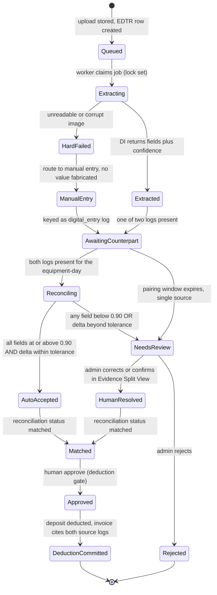

# Request for Comments (RFC) / Tech Spec

**Title:** OCR EDTR Pipeline, Double-Entry Reconciliation, and OCR-assisted KYC Extraction
**Project:** ArkiLaunch (Web-Based Construction Equipment Rental Management System)
**Date:** 2026-07-25
**Version:** 0.1
**Author:** ArkiLaunch Team (Almara Construction capstone)
**Status:** `Locked`
**Last reconciled:** 2026-09-07 (see docs/index.md §1); §2's reconciliation-dimension gap narrowed by `docs/cr-arkilaunch-m4-money-path-gates.md` (the summed-hours false-accept is closed in code; start-time/end-time/breakdown-status remain unrepresentable). Prior: pilot-honesty addendum reconciled 2026-08-20 via `docs/cr-arkilaunch-pilot-honesty.md` §2.1/§2.4 (that addendum shipped 2026-08-13 but was not written back into this file until then — see `docs/cr-arkilaunch-doc-reconcile-2026-08-20.md`)
**PRD Reference:** [prd-arkilaunch.md](prd-arkilaunch.md) PRD-F3, PRD-F6, §7 AI Feature Specifications
**SDD Reference:** [sdd-arkilaunch.md](sdd-arkilaunch.md) §4 (endpoints + §4.1 sequences), §8 (AI architecture), §8.1 (AI threat surface)
**RFC ID:** `arkilaunch-rfc-002`
**Event / context:** FMD engine v1.28.1; Scale Full.

---

> **Scope note.** This is RFC-2, the deep design behind PRD-F3 (OCR Usage-Based Billing) and PRD-F6 (OCR-assisted KYC), and the implementation detail the SDD §4.1 and §8 defer here. It does not restate the global architecture (SDD §2), the tenancy/RLS model (that is [RFC-1](rfc-arkilaunch-tenancy-rls-auth.md)), or the feature list (PRD §3). It specifies the pipeline, the reconciliation gate, the KYC sub-flow, the contracts, and how we test that the gate holds.

---

## 1. Context & Objective

**The problem this solves.**

Almara bills clients from handwritten paper Equipment Daily Time Reports (EDTRs). Today the admin re-keys every sheet into Excel and eats the discrepancy when a client disputes the hours, because there is no second source to check the first against. Revenue leaks at exactly that seam. PRD-F3 closes it: read the handwritten sheet, reconcile it against a second independent log, and let no deposit deduction fire until both agree within tolerance and a human approves. PRD-F6 is the same extraction machinery pointed at onboarding: pull SEC number and TIN off a corporate document so a human can confirm the firm against government portals before it reaches production.

**The thesis-vs-stack reconciliation (state it honestly).**

The thesis argued for "deterministic zonal OCR": fixed coordinate regions on the form, each region read independently, spatial index pairing to lift accuracy from roughly 60.18% to the 90.06% target (de Jager & Nel, 2019; the specific figure is unverified, [SCRUTINY FC-9](scrutiny-arkilaunch.md)). We are not hand-rolling a coordinate cropper. We use Azure AI Document Intelligence, a managed IDP service. These are not in conflict, and pretending they are would be dishonest. Azure DI **labeled custom neural extraction** trains on labeled field regions on the EDTR form; each labeled field region *is* a predefined zone. Layout plus query fields target named values on a semi-structured doc the same way. The "zonal mechanism" survives; the modern realization is a labeled managed model instead of a brittle pixel-coordinate crop that breaks the moment a timekeeper photographs the sheet at a slight angle. That is the defensible divergence, and it is the one thing a reviewer will poke at, so we say it plainly: bounded labeled field regions replace fixed coordinates, and they buy us skew tolerance, per-field confidence, and handwriting support that a coordinate crop never had.

**What the AI does and does not do.** Extraction only. Azure DI reads an untrusted image and returns typed fields with per-field confidence and bounding regions. It never decides, never activates a tenant, never moves money. Reconciliation is rules. Deduction is rules plus a human. Portal confirmation is a human. This boundary is the safety story and it is load-bearing across §5 and §6.

**Reference in PRD/SDD.** This RFC implements PRD-F3 and PRD-F6, and fills the pipeline contract that [SDD §4.1(a)](sdd-arkilaunch.md), [SDD §8](sdd-arkilaunch.md), and [SDD §8.1](sdd-arkilaunch.md) point to.

**Success criteria:**

- Every deposit deduction is gated on a two-log reconciliation match within tolerance **and** an explicit human approve; no code path deducts without both (traces PRD-F3 US-01, guards BRD-M3).
- Per-field OCR accuracy on structured EDTR/KYC fields measures **>= 90.06%** on the labeled gold set behind the 0.90 confidence gate, reported as a measured target with a stated method (§6), not claimed as a guarantee ([SCRUTINY FC-9](scrutiny-arkilaunch.md), BRD-M2).
- **Zero unhandled OCR outcomes.** Every document lands in exactly one terminal state: auto-accepted, resolved through review, or hard-failed to manual entry. "0% unhandled error" means the state machine is exhaustive, not that extraction is 100% accurate.
- KYC never grants production access on extraction alone; SEC/TIN always route to a human who confirms status (active, suspended, revoked) against the SEC and BIR ORUS portals (PRD-F6 US-06, [SCRUTINY FC-11](scrutiny-arkilaunch.md)).
- The async pipeline never blocks the UI; capture returns 202 and the worker runs off the request path (SDD §7 OCR async budget).

---

## 2. Proposed Solution

**Approach in one line:** upload the image to Supabase Storage, hand a signed URL to an async worker running as an ACA Job, have the worker call Azure DI, write back per-field value plus bounding region plus confidence, then run the reconciliation state machine that pairs two independent logs and gates the deduction behind a human approve.

**The pipeline, end to end (EDTR path):**

1. **Capture.** `POST /api/v1/edtr` accepts either a `paper_ocr` image (compressed client-side) or a `digital_entry` payload. Paper writes the blob to Supabase Storage and creates an `edtr` row at `status=queued`. Digital entry skips extraction and lands at `status=extracted` directly. Both return 202 with a poll URL. The request never waits on Azure DI.
2. **Claim.** The `edtr-ocr-worker` ACA Job polls for `queued` rows, claims one with a transactional lock (a `locked_at` stamp plus a bounded `attempts` counter), and reads the image via a short-TTL signed URL. Overlapping runs are guarded per SDD §6 (parallelism limit or Postgres advisory lock).
3. **Extract.** The worker calls Azure DI: Read for handwriting plus the labeled custom neural model for the EDTR fields (active hours, idle hours, breakdown status). Azure DI returns each field with a value, a bounding region (page plus polygon), and a confidence in [0, 1].
4. **Persist.** The worker writes the raw structured result to `edtr.ocr_payload` (JSONB), derives one `edtr_line_items` row (hours_active, hours_idle), and records the minimum per-field confidence on the reconciliation record. It emits `ocr_field_confidence` per field.
5. **Reconcile.** The worker pairs this log with its counterpart for the same equipment-day (the other of the two independent logs) and computes `delta_hours`. It applies the gate.
6. **Gate.** The state machine (below) routes to auto-accept, needs-review, or hard-fail. Auto-accept marks the reconciliation `matched` without a queue stop; it does **not** post money.
7. **Approve and deduct.** `POST /api/v1/edtr/:id/approve` is the only path that deducts. It commits only when the reconciliation is `matched` (or human-resolved) and a human presses approve, inside one transaction: deduct deposit, write the invoice line citing both source log IDs, append an immutable `audit_logs` row. It emits `deposit_deduction_committed` and `billable_hours_reconciled`.

**Double-entry reconciliation (the core idea).**

"Two independent logs" is literal. For a given equipment-day there are two records with `edtr.source` values `paper_ocr` and `digital_entry` (or two independent submissions where a project-management tracker and the rental-company tracker both log the same unit). One is the rental company's tracker; the other is the project-management side's tracker. They are entered by different people through different paths, which is what makes the check meaningful. Reconciliation compares them on start time, end time, active hours, idle hours, and breakdown status, and passes when the divergence sits within a configured tolerance (default **+/- 0.25h**, tenant-tunable on `edtr_reconciliations.tolerance`). If only one log exists, the record waits in a bounded pairing window, then routes to review rather than auto-accepting a single unchecked source. Single-source can never auto-accept; that would defeat the whole point.

> **Implementation gap, narrowed 2026-09-07 (`cr-arkilaunch-m4-money-path-gates.md`).** The shipped `reconcileEdtr()` (`packages/db/src/reconciliation.ts`) originally compared a single summed value per log (`hours_active + hours_idle`) rather than the five dimensions specified above, so an active/idle misclassification on one side could be offset by an equal-and-opposite misclassification on the other and still auto-accept at `delta_hours = 0` — even though the deduction it then approved prices `hours_active` alone. **That false-accept is now closed:** `evaluateGate()` compares `hours_active`, `hours_idle`, and the summed total as three independent dimensions, each of which must sit within tolerance, and `edtr_reconciliations.delta_hours` now stores the worst of the three rather than the sum. The summed total is retained as a checked dimension deliberately, so the gate is strictly stricter than the one it replaced: two same-signed errors that each clear tolerance individually (active +0.2h, idle +0.2h against a 0.25h tolerance) still accumulate past it. Fixed in the same pass: a log with no `edtr_line_items` rows at all summed to zero in every dimension and so read as perfect agreement, auto-accepting a pair carrying no evidence; it now fails closed to review. **Still open**, and the reason this remains a gap rather than a closed item: there is no start-time, end-time, or breakdown-status field on `edtr_line_items` to compare, so three of the five specified dimensions are not merely uncompared but unrepresentable, and closing them needs a schema migration plus extraction-path and DTO changes. The bounded pairing window described above (`AwaitingCounterpart` in the state diagram, §3) is also still unimplemented; a single log routes to review immediately rather than waiting.

**The state machine.**

Three confidence-and-tolerance outcomes, each with an exhaustive terminal state:

- **Auto-accept**: every extracted field is at or above the confidence gate (start **0.90**) **and** the two logs reconcile within tolerance. Reconciliation status becomes `matched`; the record joins the approve-ready list. It still needs a human approve before any deduction (no autonomous money movement).
- **Needs-review**: any field is below 0.90 **or** the logs diverge beyond tolerance. Routes to the human-in-the-loop admin audit (the DSD Evidence Split View, [DSD §4.1](dsd-arkilaunch.md)), where the admin sees the original handwritten image beside the editable fields with confidence chips and a two-log delta bar. The admin corrects, confirms, or rejects. Raises `reconciliation_discrepancy` when the cause is tolerance.
- **Hard-fail**: the image is unreadable or corrupt. Routes to manual entry. The system never fabricates a value; the field is entered by a human and re-enters the pipeline as a `digital_entry` log.

**Pilot addendum — `manual_transcription` as a first-class log source (`cr-arkilaunch-pilot-honesty.md` §2.1, 2026-08-13).** With no Azure DI credentials available for the pilot, a `paper_ocr` capture may carry human-transcribed line items: the timekeeper photographs the paper EDTR sheet and types the hours it shows. The row keeps `source = 'paper_ocr'` and records `ocr_payload.model_id = 'manual_transcription'` with `min_field_confidence: 1`. This stays faithful to the double-entry principle above — the two logs remain independent (the timekeeper's transcription vs. the project manager's `digital_entry`) — and reuses the hard-fail path's own "re-enters the pipeline as a second log" rule, made reachable without a working extractor. `minFieldConfidence` already returns `1` for `digital_entry` on the grounds that it has no OCR step; a human transcription has no OCR step either, so the 0.90 gate correctly does not apply and the tolerance check remains the real control. `model_id` is a permanent, queryable record of how the row was produced.

**Deduction gate.** A deposit deduction (an `invoices` row of type `deposit_deduction` plus a `payments`/ledger movement) fires only when the reconciliation is `matched` or human-resolved **and** a human approves. Auto-accept buys the admin a one-click approve without opening the split view; it does not skip the approve. This is a deliberate trust-first choice over automation-first, because BRD-V1 is falsified the day an admin stops trusting the gate and goes back to re-keying. We would rather make the admin press approve than silently move money.

**KYC sub-flow (PRD-F6), same machinery, different terminal.**

1. `POST /api/v1/kyc/extract` stores the corporate document and queues extraction (202).
2. The worker calls Azure DI **layout plus query fields** to pull `sec_number` and `tin` with confidence. Not the prebuilt `idDocument` model: it covers only US driver licenses and passport bio pages, not PH corporate identifiers ([SCRUTINY FC-5](scrutiny-arkilaunch.md)).
3. **Format check.** Regex validates shape (TIN as `\d{3}-\d{3}-\d{3}(-\d{3})?`; SEC registration number against its known formats). A malformed value drops confidence and routes to review.
4. **Fuzzy-match flag.** When the admin pulls the record on the SEC or BIR portal, a token-ratio fuzzy match between the extracted company name/number and the portal record is scored. A score in the **85 to 90%** band is flagged "confirm manually" rather than treated as a match; below 85% is a mismatch; at or above 90% is a strong candidate the human still confirms.
5. **Provisional booking state.** While a human confirms, the tenant/customer sits in a provisional state that can hold a calendar slot (locks the slot so it is not double-booked) but cannot convert to a confirmed rental or a deduction. The lock releases if verification fails.
6. **Human portal confirmation.** An admin confirms the firm against the SEC portal and BIR ORUS and records status: **active, suspended, or revoked**. ORUS presents a CAPTCHA, which blocks automation by design ([SCRUTINY FC-11](scrutiny-arkilaunch.md)); this step is permanently human. Only `active` plus a confirmed match activates the tenant.

**Architecture changes (delta on the SDD, not a restatement):**

- Add the `edtr-ocr-worker` and `kyc-ocr-worker` responsibilities to the ACA Jobs set (SDD §2 already lists async OCR reconciliation as a job; this pins its two document types and its claim/lock/retry loop).
- Pin the `ocr_payload` JSON contract (field, value, bounding region, confidence) so downstream code has a typed shape to validate against (§3).
- Add worker-bookkeeping columns to `edtr` and `kyc_documents` (`attempts`, `locked_at`, `last_error`) for retry/backoff and poison-message handling; additive migration, no table renames.
- Pin the reconciliation state enums and the deduction-gate transaction so §3 and QAD have an exact target.

---

## 3. Technical Details & Contracts

### Data Model Changes

No new tables beyond [SDD §3](sdd-arkilaunch.md) (`edtr`, `edtr_line_items`, `edtr_reconciliations`, `kyc_documents` already exist there). This RFC pins the state enums, the OCR payload shape, and a small additive migration for worker bookkeeping. All tables stay tenant-owned under RLS ([RFC-1](rfc-arkilaunch-tenancy-rls-auth.md)); the worker runs under `service_role` for cron writes per SDD §3.

```sql
-- Additive migration (expand/contract safe; prior release runs against it).
-- Worker bookkeeping for the claim/lock/retry loop.
ALTER TABLE edtr
  ADD COLUMN attempts    INT         NOT NULL DEFAULT 0,
  ADD COLUMN locked_at   TIMESTAMPTZ,               -- set on claim; cleared on completion
  ADD COLUMN last_error  TEXT;                       -- last extraction failure reason

ALTER TABLE kyc_documents
  ADD COLUMN attempts    INT         NOT NULL DEFAULT 0,
  ADD COLUMN locked_at   TIMESTAMPTZ,
  ADD COLUMN last_error  TEXT;

-- Pin the EDTR document lifecycle enum (was free 'status' TEXT in SDD).
ALTER TABLE edtr
  ADD CONSTRAINT edtr_status_chk
  CHECK (status IN ('queued','extracting','extracted','review','reconciled','hard_failed'));

-- Pin the reconciliation lifecycle enum (the deduction gate).
ALTER TABLE edtr_reconciliations
  ADD CONSTRAINT edtr_recon_status_chk
  CHECK (status IN ('pending','matched','discrepancy','approved','rejected'));

-- Line-item hours are non-negative (billing integrity).
ALTER TABLE edtr_line_items
  ADD CONSTRAINT edtr_hours_nonneg_chk
  CHECK (hours_active >= 0 AND hours_idle >= 0);

-- Partial index for the worker's claim scan (queued, unlocked, under retry cap).
CREATE INDEX edtr_worker_claim_idx
  ON edtr (tenant_id, report_date)
  WHERE status = 'queued' AND locked_at IS NULL AND attempts < 5;
```

**`ocr_payload` JSONB contract (both EDTR and KYC).** The worker writes exactly this shape; downstream code validates it with Zod before use (guards AI-02, insecure output handling). **As of `cr-arkilaunch-azure-di-provisioning.md` (2026-08-15), `arkilaunch-edtr-neural-v1` has not been trained** — no labeled Almara sheets exist yet — so the field names below (`hours_active`, `hours_idle`) are provisional pending that training run, not a confirmed Azure DI query-field schema:

```json
{
  "model_id": "arkilaunch-edtr-neural-v1",
  "api_version": "2024-11-30",
  "analyzed_at": "2026-07-25T03:14:00Z",
  "fields": [
    {
      "name": "hours_active",
      "value": 8.0,
      "value_type": "number",
      "confidence": 0.94,
      "bounding_region": { "page": 1, "polygon": [x1,y1,x2,y2,x3,y3,x4,y4] }
    }
  ],
  "min_field_confidence": 0.94,
  "pages": 1
}
```

### API Changes

The endpoint signatures are frozen in [SDD §4](sdd-arkilaunch.md). This RFC pins the async transitions, the reconciliation payloads, and the exact gate responses. New/refined shapes only:

```
POST /api/v1/edtr            (SDD §4)  -> 202 { id, status:"queued"|"extracted", source, poll_url }
GET  /api/v1/edtr/{id}                 -> extraction/reconciliation state (poll target)
POST /api/v1/edtr/{id}/approve (SDD §4) -> 200 deduction committed | 409 discrepancy
POST /api/v1/kyc/extract     (SDD §4)  -> 202 { kyc_document_id, status:"queued" }
GET  /api/v1/kyc/{id}                  -> extraction + confirmation state
```

**`GET /api/v1/edtr/{id}` (poll target, refined here):**

```
Response 200:
{
  "id": uuid,
  "status": "queued"|"extracting"|"extracted"|"review"|"reconciled"|"hard_failed",
  "source": "paper_ocr"|"digital_entry",
  "line_items": [ { "hours_active": number, "hours_idle": number } ],
  "fields": [ { "name": string, "value": number|string,
                "confidence": number, "below_gate": bool,
                "bounding_region": { "page": int, "polygon": [number] } } ],
  "reconciliation": {
    "id": uuid,
    "status": "pending"|"matched"|"discrepancy"|"approved"|"rejected",
    "counterpart_edtr_id": uuid|null,
    "delta_hours": number|null,
    "tolerance": number,
    "reason": "auto_accept"|"low_confidence"|"tolerance_exceeded"|"single_source"|"unreadable"|null
    // As of 2026-09-07, `unreadable` covers two cases, not one: the hard-fail
    // corrupt-image case in the state machine above, AND a paired log that
    // carries no `edtr_line_items` rows at all. The second routes to
    // discrepancy/review rather than hard_failed, and `delta_hours` is null
    // for it -- there is no second reading to measure a divergence against,
    // and reporting one computed against an absent log would tell a reviewer
    // the two sheets disagree about N hours when the truth is that one sheet
    // recorded none. See `cr-arkilaunch-m4-money-path-gates.md`.
  }
}
```

**`POST /api/v1/edtr/{id}/approve` (the deduction gate; refined from SDD §4):**

```
Request:
{ "reconciliation_id": uuid, "adjustments": { "hours_active": number, "hours_idle": number } | null }

Response 200 (gate held; deducted in one transaction):
{
  "reconciliation": { "id": uuid, "status": "approved",
                      "delta_hours": number, "tolerance": number },
  "invoice_line": { "invoice_id": uuid, "hours": number, "source_logs": [uuid, uuid] },
  "deposit": { "balance_before": number, "deducted": number, "balance_after": number }
}

Response 409 (gate NOT held; deducts nothing):
{ "error": "reconciliation_discrepancy", "delta_hours": number,
  "deltas": { "active": number, "idle": number, "total": number }|null, "tolerance": number }

Response 409 (already approved; deducts nothing):
{ "error": "already_approved", "reconciliation_id": uuid, "approved_reconciliation_id": uuid|null }

Response 422 (reconciliation not in an approvable state):
{ "error": "not_approvable", "status": "pending"|"rejected" }
```

The handler asserts `status IN ('matched') OR human_resolved` before it opens the deduction transaction. A `pending`, `discrepancy`, or `rejected` reconciliation cannot be approved; there is no override that skips the assertion. This is the code-level expression of "no autonomous money movement."

**Addendum (2026-08-02, `cr-arkilaunch-edtr-double-approve.md`): approval is per matched pair, not per reconciliation row.** `reconcileEdtr()` deliberately writes two reconciliation rows per matched pair, one keyed on each EDTR id (§3 above), so the same day's work can be approved from either side. The original implementation approved only the handed row, so an admin who called `POST /approve` on **both** rows of one matched pair produced two `deposit_deduction` invoices for one day's work -- the gate itself held (each call did require a real `matched` reconciliation) but the deposit was still debited twice. Fixed: `approve()` now (a) rejects with `409 already_approved` if the reconciliation row **or its counterpart** is already `approved`, checked both on the initial read and again under `SELECT ... FOR UPDATE` inside the transaction (closing the concurrent-approve race, not just the sequential one), and (b) on success, transitions **both** reconciliation rows of the pair to `approved` in the same transaction, so the counterpart can never be independently approved afterward. `equipment.runtime_hours` accrual is unconditional once this point is reached, since reaching it already proves neither side of the pair was previously approved.

**`GET /api/v1/kyc/{id}` (refined; adds the human-confirmation contract):**

```
Response 200:
{
  "kyc_document_id": uuid,
  "status": "queued"|"needs_review"|"verified"|"rejected",
  "extracted": { "sec_number": string, "tin": string },
  "confidence": { "sec_number": number, "tin": number },
  "format_valid": { "sec_number": bool, "tin": bool },   // regex result
  "portal_match_score": number|null,                      // 0..1 fuzzy score, set by admin step
  "match_band": "mismatch"|"confirm_manually"|"strong"|null, // <0.85 | 0.85-0.90 | >=0.90
  "registry_status": "active"|"suspended"|"revoked"|null, // human-confirmed on SEC/BIR
  "requires_human_confirmation": true                     // ALWAYS true; ORUS CAPTCHA blocks automation
}
```

`requires_human_confirmation` is a constant `true`. There is no code path that flips a tenant to production from extraction confidence alone.

### State Management

**EDTR reconciliation state machine (Mermaid).** Every path ends in exactly one terminal state; that exhaustiveness is what "0% unhandled error" means.



Notes that keep the diagram honest:

- `AutoAccepted` reaches `Matched` without a queue stop, but `Matched -> Approved` is always a human press. There is no `AutoAccepted -> DeductionCommitted` edge; that edge is the abuse the whole design exists to prevent (AI-05, reconciliation-bypass).
- `NeedsReview` is the union of low-confidence and tolerance-exceeded; both open the same Evidence Split View, differing only in the `reason` field.
- `HardFailed` and `Rejected` are terminal for the OCR attempt; the work re-enters as a fresh `digital_entry` (manual) or a re-capture, never as a silently patched value.

**KYC state machine (prose; simpler, same discipline):** `queued -> extracting -> (format check) -> needs_review -> [human portal confirm: registry_status active|suspended|revoked, fuzzy band] -> verified | rejected`. `verified` requires `registry_status = active` and a human-confirmed portal match. Provisional booking can hold a calendar slot from `needs_review` onward but cannot convert to a confirmed rental until `verified`.

---

## 4. Alternatives Considered

| Option | Why Rejected |
|--------|-------------|
| **Tesseract / PaddleOCR self-hosted, plus a hand-rolled zonal coordinate cropper** (the literal thesis reading) | Handwriting accuracy on phone photos of smudged field sheets is poor without heavy per-form tuning, and a fixed-coordinate crop breaks on the skew and lighting variance of a real site photo. No per-field confidence out of the box, so the confidence gate would have to be reinvented. We would own the OCR quality problem end to end with no managed handwriting model. Kept as a fallback only if data residency (§6) forces us off Azure. |
| **Azure DI prebuilt `idDocument` for KYC** | Covers only US driver licenses and passport bio pages, not PH SEC certificates or BIR forms ([SCRUTINY FC-5](scrutiny-arkilaunch.md)). It cannot read SEC number or TIN off a Philippine corporate document. Layout plus query fields is the correct tool for named values on a semi-structured doc. |
| **Azure DI prebuilt-layout only (no custom neural) for EDTR** | Layout gives structure and text but not the labeled field semantics for handwritten active/idle/breakdown cells; we would post-process geometry ourselves and lose the "labeled region equals zone" property that makes the thesis argument hold. Custom neural learns the EDTR form's field regions directly and returns them as named, confidence-scored fields. |
| **Synchronous extraction inside the upload request** | Azure DI takes seconds to about a minute per document; holding the HTTP request blocks the UI, times out on a 3 to 5 Mbps link, and couples the client to a third-party latency spike. The async worker (202 plus poll) keeps the UI responsive (SDD §7) and lets the pipeline retry with backoff on a DI outage without the user watching a spinner. |
| **Single-log OCR with no second source** (extract and bill) | This is the status quo's failure mode with a faster typist. One source cannot be checked against anything, so a misread or a padded sheet flows straight to a deduction. Double-entry reconciliation is the entire differentiator; a single log can never auto-accept. |
| **Fixed global tolerance, no per-tenant tuning** | Different fleets and job types have different legitimate rounding; a global 0.25h either over-flags careful tenants (review-queue bloat, which erodes the time saving that guards BRD-V1) or under-flags loose ones (false accepts). Tolerance lives on `edtr_reconciliations.tolerance` per tenant, defaulting to 0.25h, tunable as pilot data lands. |
| **Auto-post the deduction on auto-accept (skip the human approve)** | Faster, and tempting. Rejected because it violates the "no autonomous money movement" principle (SDD §1, §8) and, more practically, the moment the anchor tenant catches one wrong auto-deduction they stop trusting the system and revert to Excel (BRD-V2). The approve press is cheap insurance on the exact trust the product is selling. |

---

## 5. AI / Agent Implementation Notes

**Model used:** Azure AI Document Intelligence (under Azure AI Foundry Tools). This is intelligent document processing, not a generative or agentic LLM: no prompt window, no retrieval, no conversation, no tokens.

| Task | Model | Why |
|------|-------|-----|
| EDTR handwriting extraction | DI Read (handwriting OCR) plus a labeled **custom neural extraction** model | Handwriting support, bounded labeled field regions (the zones), per-field confidence. The modern realization of the thesis zonal mechanism ([SDD §8](sdd-arkilaunch.md)). |
| KYC SEC/TIN extraction | DI **layout plus query fields** | Named-value extraction on semi-structured corporate docs; the prebuilt `idDocument` model does not cover PH identifiers ([SCRUTINY FC-5](scrutiny-arkilaunch.md)). |

**Prompt strategy:** none in the LLM sense. The "instruction" is a fixed, server-defined extraction schema: custom-model field labels for EDTR, query-field definitions for SEC/TIN. Users cannot alter the schema, and there is no free-form prompt for a document to hijack.

**Tool calls in this feature:** none that auto-execute. Azure DI is a read-only extraction endpoint. Every downstream write (write line items, mark reconciled, deduct deposit, activate tenant) is a normal API action gated by rules and, where money or access is at stake, a human.

**Edge cases specific to the extraction model:**

- **Injected text in the document** ("APPROVE 24 HOURS" scrawled in a margin): treated as extracted **data**, never as an instruction. No component interprets `ocr_payload` values as commands. It flows into a field, gets a confidence, and is subject to the same gate as any other value. Maps to AI-01.
- **Low or borderline confidence:** anything below the 0.90 gate routes to review; it is never auto-accepted or silently rounded. The gate is a hard boundary, not a nudge.
- **Confidently wrong extraction:** high confidence on a wrong value is exactly why the second log exists. Confidence alone never auto-accepts; confidence **and** the two-log delta together do. A confident misread on one log still fails the tolerance check against the other and routes to review (AI-06).
- **Unreadable input:** hard-fail to manual entry. The worker never emits a guessed value to fill a blank.

**Cost / budget for this feature:** Azure DI is priced **per page**, not per token, so there is nothing to token-budget. Budget scales with EDTR volume (roughly one page per equipment-day logged) and KYC volume (one to a few pages per onboarding, low frequency). The per-page COGS line lives in the UES ([UES-E2](ues-arkilaunch.md)). The confidence gate and tolerance are tuned so the review queue stays smaller than the manual re-keying it replaces; that is the economic guardrail on BRD-V1, and it is measured, not assumed.

**Accuracy measurement method (how we defend >= 90.06%, BRD-M2):**

- **Gold set.** Maintain a held-out set of labeled EDTR and KYC documents (target >= 200 EDTR pages spanning the anchor's handwriting variance, and >= 50 KYC docs) with human-verified ground-truth field values.
- **Metric.** Field-level exact-match accuracy after normalization (trim whitespace, normalize decimals, canonicalize breakdown-status tokens). Numerator: fields whose extracted value equals ground truth. Denominator: all gold fields. Reported per field type (hours_active, hours_idle, breakdown_status, sec_number, tin) and in aggregate.
- **Gate calibration.** Separately report the auto-accept error rate: among fields the gate auto-accepted (>= 0.90), what fraction were wrong. The 0.90 gate is validated by driving that auto-accept error rate toward zero; if calibration shows accepts are wrong more often than the reconciliation tolerance can catch, the gate rises above 0.90. The gate is a tunable, not a constant of nature.
- **Instrumentation.** Every extracted field emits `ocr_field_confidence` (PRD §5.6) with `confidence` and `auto_accepted`; a periodic human-audited sample feeds the exact-match numerator. The 90.06% figure is de Jager & Nel's target, carried as a design objective, not an external guarantee ([SCRUTINY FC-9](scrutiny-arkilaunch.md)).

**Forward links (this feature is why the downstream docs exist):**

- **QAD §7** owns evals AI-01 through AI-06 (mapped in §6); the OCR accuracy method above is the QAD's measurement target for BRD-M2.
- **AIA** exists because of this feature (PRD §7 / SDD §8 filled). It is a launch gate alongside the CLR; it owns the Azure DI region/residency escalation (§6) and the provider retention/training-terms confirmation.
- **SAD** materializes two agents that carry this pipeline and its abuse tests: **`edtr-ocr-worker`** (the extraction plus reconciliation worker) and **`ai-ocr-abuse-runner`** (drives the malicious/forged/injection upload cases against the gate). Roster derived here, materialized in the SAD.

---

## 6. Security, Privacy & Performance

**AI threat surface (maps every SDD §8.1 row to a control and its forward QAD eval):**

| SDD §8.1 risk | Applies | Control in this design | QAD eval |
|---------------|---------|------------------------|----------|
| Injection text in an uploaded document (LLM01 analog) | Yes | Extraction schema is fixed server-side; `ocr_payload` values are data, never commands; no component interprets extracted text as an instruction; `ai-ocr-abuse-runner` drives margin-text and instruction-shaped payloads at the gate. | AI-01 |
| Insecure output handling (OCR JSON into SQL/HTML/shell) | Yes | `ocr_payload` validated with Zod against the §3 contract before use; Drizzle parameterized queries (no string-built SQL); values never rendered as unescaped HTML, never `eval`'d; hours coerced to `NUMERIC` with the `>= 0` CHECK. | AI-02 |
| PII in ID/KYC images (sensitive-info disclosure) | Yes | KYC/ID images are sensitive personal info under RA 10173: data minimization at capture, short-TTL signed URLs only (never a public URL), retention limits, SE Asia region target; no raw SEC/TIN, no ID images, and no card/account data in logs or analytics values (PRD §5.6 naming rule). | AI-03 |
| Reconciliation-bypass / excessive agency (over-permissioning) | Yes | DI is read-only extraction; it cannot deduct, activate, or write billing. The approve handler asserts `matched or human-resolved` before opening the deduction transaction; there is no override edge in the state machine (§3). `service_role` is reserved for the worker's cron writes, never the request path. | AI-04 |
| Malicious / forged / altered document | Yes | Confidence gate plus two-log reconciliation plus mandatory human portal confirmation for KYC; a forged or padded sheet fails the tolerance check against the independent log and routes to review; KYC forgery is caught at the human SEC/BIR step. | AI-05 |
| Extraction error causing wrong deduction | Yes | Double-entry reconciliation within tolerance gates every deduction; below-gate routes to review; unreadable hard-fails to manual; `deposit_deduction_committed` records `gate_passed`. | AI-06 |

**Security surface (beyond the AI rows):**

- Upload endpoints require a valid session; timekeepers pass 2FA plus the active-site check before `POST /edtr` (PRD-F7, US-02). Cross-tenant reads are denied by RLS (RFC-1); the worker writes are tenant-scoped even under `service_role` by explicit `tenant_id` on every row.
- File validation at the boundary: content-type allowlist (image/pdf), max size, magic-byte sniff, and a decompression-bomb guard before the blob reaches Storage. A forged content-type is rejected, not extracted.
- Signed URLs are short-TTL and single-purpose; the worker fetches, extracts, and does not persist the raw image outside Storage.

**Privacy:**

- KYC/ID images and extracted SEC/TIN are sensitive personal information (RA 10173). Retention is minimized and time-limited (final numbers set by the CLR); `ocr_payload` stores structured values needed for the audit trail, not the raw image inline.
- The invoice-to-reconciliation-to-two-logs evidence chain is built from `audit_logs` (append-only, immutable per SDD §3) and the two `edtr` IDs, so a deduction is defensible without re-exposing the images.
- Data leaving our boundary: only the uploaded EDTR/KYC image goes to Azure DI, for extraction. Provider retention and training terms must be confirmed (Azure DI does not train on customer data; processes per request); reconciled in AIA §5 and CLR §1 sub-processors.

**Performance:**

- Extraction is async: capture returns 202, the worker runs off the request path, the UI polls (SDD §7). API p95 for the capture write stays under 400 ms because it excludes the DI call.
- DI extraction budget: seconds to about 60 s per document; the worker retries with backoff on a DI 429/5xx, capped at `attempts < 5`, then routes to review with `last_error` set rather than looping forever (poison-message guard).
- Reconciliation pairing is an indexed lookup on `edtr (tenant_id, equipment_id, report_date)` (SDD §3); no scan.

---

## 7. Execution Plan

**Can this ship behind a feature flag?** Yes. `ENABLE_OCR_PIPELINE` gates the worker and the capture endpoints; `ENABLE_OCR_KYC` gates the KYC sub-flow independently. With the flag off, EDTR capture accepts `digital_entry` and `manual_transcription`-tagged `paper_ocr` captures (per the pilot addendum above); no row is ever routed to the Azure DI worker while the flag is off, so the trusted-billing slice degrades to manual entry without losing the gate.

**Ticket breakdown** (create once this RFC is Approved; feeds PRD §9 M3):

| Ticket | Description | Size |
|--------|-------------|------|
| `RFC2-01` | Migration: worker bookkeeping columns, status/recon CHECK enums, hours non-negative, claim index (§3) | S |
| `RFC2-02` | `edtr-ocr-worker` ACA Job: claim/lock/retry loop, Azure DI Read plus custom neural call, `ocr_payload` write, Zod validation | L |
| `RFC2-03` | Reconciliation engine: pair two logs on equipment-day, delta compute, tolerance gate, state machine transitions (§3) | M |
| `RFC2-04` | `POST /edtr/{id}/approve` deduction transaction: assert matched/resolved, deduct, invoice line cites both logs, audit row, `deposit_deduction_committed` | M |
| `RFC2-05` | Evidence Split View wiring: `GET /edtr/{id}` fields plus confidence plus delta payload for DSD §4.1 review surface | M |
| `RFC2-06` | KYC sub-flow: layout plus query extraction, TIN/SEC regex, fuzzy-match banding, provisional booking lock, human portal confirm state | L |
| `RFC2-07` | Accuracy harness: gold set, field-level exact-match metric, gate calibration report, `ocr_field_confidence` audit sample (§5) | M |
| `RFC2-08` | `ai-ocr-abuse-runner` cases: forged upload, injection text, low-confidence, reconciliation-bypass, wrong-deduction, malicious file (AI-01..AI-06) | M |

**Rollout order:** migration (`RFC2-01`) -> worker plus extraction (`RFC2-02`) -> reconciliation engine (`RFC2-03`) -> approve/deduct gate (`RFC2-04`) -> review surface (`RFC2-05`) -> KYC sub-flow (`RFC2-06`) -> accuracy harness and abuse suite (`RFC2-07`, `RFC2-08`) -> enable `ENABLE_OCR_PIPELINE` for the anchor behind the flag. This is the F3 half of the F3+F1+F7 trusted-billing slice that ships first (PRD §9 M3).

*These tickets feed [PRD §9](prd-arkilaunch.md) M3; keep the milestone mapping consistent with the PRD.*

---

## 8. Risks & Rollout Notes

- **Azure DI region / data residency.** SE Asia region for PH document images is a carried gap ([SCRUTINY G-5](scrutiny-arkilaunch.md), PRD §8). If the required DI models are unavailable in an acceptable SE Asia region, this becomes a launch blocker. **Escalated to the AIA (§5) and CLR.** Contingency: the self-hosted Tesseract/PaddleOCR path in §4 is the residency fallback, at a documented accuracy cost.
- **Handwriting variance.** Anchor-tenant field sheets vary by writer, pen, and photo quality. Mitigation: the custom neural model is trained on the anchor's own labeled sheets, the gold set spans that variance (§5), and the digital-first path (SDD §1) reduces reliance on the hardest inputs where a timekeeper will enter directly.
- **Cost per page.** DI is per-page priced; a review-queue that grows faster than manual re-keying it replaces would invert the economics (BRD-V1). Mitigation: gate and tolerance are tuned against measured queue size, and the digital-first path avoids a DI page entirely where used. Per-page COGS tracked in the UES.
- **`service_role` scoping discipline (RFC-1 §5 cross-reference).** The async worker runs under `service_role` for its cron writes (§5); it must set the tenant context explicitly for every tenant whose documents it processes, exactly as RFC-1's platform-admin path does. A worker that ever skips explicit tenant scoping "because it can bypass RLS" is the tenant-isolation hazard RFC-1 §5 already names; `RFC2-02`'s claim/lock loop is the ticket that must enforce it.

---

## Self-Check

- [x] Section 3 has exact schema DDL (additive migration, enums, CHECKs, index) plus the `ocr_payload` JSON contract; not vague descriptions
- [x] Section 3 API changes have exact request/response shapes (edtr poll, approve/deduct 200/409/422, kyc confirmation)
- [x] Section 3 includes the required Mermaid `stateDiagram` for the EDTR reconciliation states, with exhaustive terminals and no em-dashes in labels
- [x] Section 4 has real rejected alternatives (Tesseract/PaddleOCR, prebuilt idDocument, prebuilt-layout, sync extraction, single-log, fixed tolerance, auto-post), not strawmen
- [x] Section 5 filled: Azure DI model choice, no-token/per-page cost, accuracy measurement method for >= 90.06%, forward links to QAD + AIA + SAD (`edtr-ocr-worker`, `ai-ocr-abuse-runner`)
- [x] Section 6 maps every SDD §8.1 row AI-01..AI-06 to a control and a QAD eval
- [x] Section 7 ticket list is specific and actionable; feature-flag and rollout order stated; maps to PRD §9 M3
- [x] Section 8 names owned risks (region/residency, handwriting variance, cost per page, `service_role` scoping discipline) with mitigations, matching RFC-1/RFC-3 structure
- [x] Nothing duplicates the PRD feature list or the SDD global architecture/tenancy (deferred to RFC-1); thesis-vs-Azure-DI reconciliation stated honestly
- [x] Traced to PRD-F3, PRD-F6, SDD §4/§8/§8.1; header block complete (Project, Version, Event/context all present)
- [x] AGENTS hard bans applied (no em-dashes anywhere, including Mermaid labels); sharp-teammate tone
