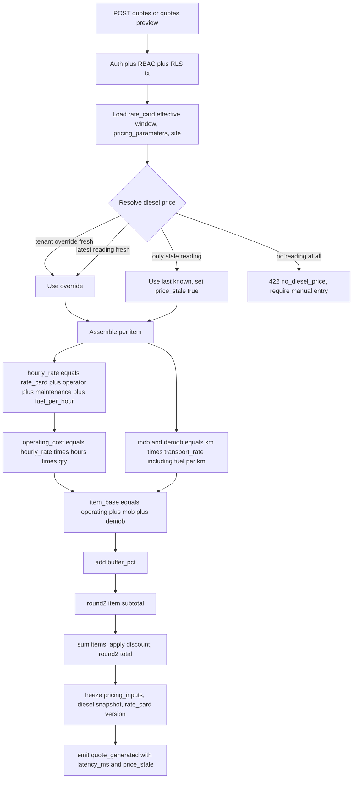

# Request for Comments (RFC) / Tech Spec

**Title:** Diesel-Indexed Dynamic Quotation & Pricing Engine
**Project:** ArkiLaunch (Web-Based Construction Equipment Rental Management System)
**Date:** 2026-07-25
**Version:** 0.1
**Author:** ArkiLaunch Team (Almara Construction capstone)
**Status:** `Draft`
**Last reconciled:** N/A (not yet reconciled with code)
**PRD Reference:** [prd-arkilaunch.md](prd-arkilaunch.md) PRD-F1 (Dynamic Quotation Engine); US-03; BRD-M4
**SDD Reference:** [sdd-arkilaunch.md](sdd-arkilaunch.md) §3 (RateCard / Quotation / QuotationItem), §4 (`POST /api/v1/quotes`), §4.1(b) (quote sequence)
**RFC ID:** `arkilaunch-rfc-003`
**Event / context:** FMD engine v1.28.1; Scale Full.

---

> **Note:** This is RFC-3, the deep design behind PRD-F1. It resolves gap **G-3** (diesel-price source, unnamed in the thesis) and specifies the pricing math, the snapshot-for-reproducibility model, and the quote API. The *what* lives in the [PRD](prd-arkilaunch.md); the *how* at system level in the [SDD](sdd-arkilaunch.md). Sibling RFCs: [RFC-1](rfc-arkilaunch-tenancy-rls-auth.md) (tenancy/RLS/auth, PRD-F7), [RFC-2](rfc-arkilaunch-ocr-edtr-reconciliation.md) (OCR/reconciliation, PRD-F3). Forward-linked to the QAD (test rows `QAD-T43`..`T48`, §7 below) and the [CLR](clr-arkilaunch.md) (legal-review note on scraping).

---

## 1. Context & Objective

**The problem this solves:**

Rhea, Almara's sole back-office administrator, hand-calculates every quote in 20 to 30 minutes (PRD §2). The inputs are volatile: the pump price of diesel, the mobilization and demobilization distance to a site, the per-equipment hourly rate, a maintenance allowance, and operator labor. Each of these moves, and every quote re-derives them by hand on a phone or in Excel. Two parts are genuinely hard:

- **(a) Sourcing a live diesel price.** There is no canonical free Philippine diesel-price API. The Department of Energy (DOE) publishes an oil price watch as a public web page, retailers publish nothing machine-readable, and paid feeds exist but add cost and a procurement dependency for a single number.
- **(b) Making each quote reproducible.** Prices move between the day a quote is sent and the day a dispute is raised. A quote that silently re-prices against today's diesel or today's rate card is not auditable. The number Rhea quoted has to survive a later price change intact.

**Objective:** compute a diesel-indexed quote in well under a minute, snapshot every price input into the quotation so the number is reproducible forever, and never price against an unknown value.

**Reference in PRD/SDD:**
This RFC implements **PRD-F1** (`US-03`) and the **SDD §3/§4** quotation cluster. It fills the SDD's explicit hook: "The quote engine is built against an interface, and the current price is snapshotted into every versioned quotation so pricing is reproducible regardless of source" (SDD §1) and "the quotation/diesel contract in RFC-3" (SDD §4).

**Success criteria:**
- A quote (preview or create) returns in **< 60 s end to end** (US-03 / BRD-M4), typically < 5 s, because pricing is pure arithmetic on already-fetched rows with **no external call on the hot path**.
- A quote is **byte-for-byte reproducible**: re-running the formula against a stored quotation's snapshot reproduces every line total to the centavo.
- When the diesel source is stale or unavailable, the quote uses the last-known price, is **labeled with the price date and a staleness warning**, and never prices silently against an unknown value (US-03 failure criterion).
- The diesel refresh path respects robots.txt and RA 10175, and the feature works with the scraper fully disabled (manual entry always available).

---

## 2. Proposed Solution

**Approach in one line:** a small out-of-band price-refresh loop feeds a persisted "last-known diesel price" row; the quote endpoint reads that row, runs a deterministic pricing formula, and freezes every input it used into the quotation and its items.

Three moving parts.

**1. Diesel price supply (resolves G-3): a hybrid, decoupled from the quote path.**

A scheduled **ACA Job** (Azure Container Apps cron, the same host family that runs the weather poll and PM notifications, SDD §2/§6) fetches the DOE public oil-price-watch page once per run, parses the diesel figure, sanity-checks it, and writes a new `diesel_price_readings` row. Two human overrides sit on top:

- **Platform manual entry:** a platform admin can post a reading (used when the scrape breaks or DOE changes layout).
- **Tenant manual override:** Rhea can set a local override on the tenant's pricing parameters (used when she has a fresher pump price than the last scrape, or wants to hold a negotiated fuel basis).

The quote path never calls DOE. It reads the resolved price from the database. The scrape is a supplier to a cache, not a dependency of the request. If the scrape is disabled entirely, manual entry keeps the feature fully functional. Details and the legal posture in §3 and §6.

**2. Pricing formula: deterministic, diesel-indexed, buffered.** A per-item effective hourly rate is assembled from the time-variant rate card, operator labor, maintenance allowance, and a fuel component derived from the diesel index. Mobilization and demobilization distance add a transport component (also diesel-indexed). A buffer percentage and an optional quote-level discount close it out. Full formula in §3.

**3. Snapshot for reproducibility.** At compute time the engine freezes the effective diesel price, its source and observed date, and the full set of pricing inputs (rate-card row id + rate value + effective window, operator/maintenance/buffer/fuel factors) into the quotation and each quotation item. A later rate-card edit or diesel move cannot alter a saved quote. Quotations are **versioned** (revision chain) and move through **draft to approved**; a printable view renders the frozen numbers.

**Architecture changes:**
- New global reference table `diesel_price_readings` (the last-known-price cache; DOE scrape + manual entries).
- New tenant-owned table `pricing_parameters` (time-variant operator rate, maintenance allowance, buffer percentage, fuel-consumption factors, and the tenant diesel override).
- `quotations` and `quotation_items` gain snapshot and computed-money columns plus a revision link (extends the SDD §3 columns, which already carry `revision`, `diesel_price_snapshot`, `price_stale`).
- New ACA Job `diesel-refresh` (scrape + parse + sanity-check + write), guarded against overlapping runs like the other jobs (SDD §6).
- New endpoints: `POST /quotes/preview` (compute, no persist), `POST /quotes` (persist draft with snapshot), `POST /quotes/:id/revise`, `POST /quotes/:id/approve`, plus the existing `GET /quotes/:id` (printable). Refines the SDD §4 high-level shape.

---

## 3. Technical Details & Contracts

### Data Model Changes

Conventions follow SDD §3: UUID PK, tenant-owned tables carry `tenant_id UUID NOT NULL` (FK `tenants.id`, `ON DELETE RESTRICT`) and `created_at TIMESTAMPTZ NOT NULL DEFAULT now()`, and RLS is enabled and **forced** on every tenant-owned table with the full `tenant_isolation` policy (`FOR ALL`, `TO app_authenticated`, `USING` + `WITH CHECK`, `missing_ok = true`) defined in [RFC-1](rfc-arkilaunch-tenancy-rls-auth.md) §3, never the bare `USING`-only form.

**New table `diesel_price_readings`** (global reference, NOT tenant-scoped; like `equipment_types` and `subscription_plans` it is shared, public, non-PII data)

```sql
CREATE TABLE diesel_price_readings (
  id            UUID PRIMARY KEY DEFAULT gen_random_uuid(),
  region        TEXT NOT NULL DEFAULT 'NCR',          -- DOE prices vary by region; Almara (Quezon City) = NCR
  price_php     NUMERIC(8,4) NOT NULL,                -- PHP per liter
  observed_date DATE NOT NULL,                        -- the date the price applies to (from DOE), not capture time
  source        TEXT NOT NULL,                        -- 'doe_scrape' | 'platform_manual' | 'admin_override'
  source_url    TEXT,                                 -- provenance; the DOE page fetched
  captured_at   TIMESTAMPTZ NOT NULL DEFAULT now(),
  captured_by   UUID REFERENCES users(id),            -- null for the scraper; set for manual entries
  CONSTRAINT price_sane CHECK (price_php BETWEEN 20 AND 150),   -- reject a mis-parse; PH diesel realistic band
  CONSTRAINT source_valid CHECK (source IN ('doe_scrape','platform_manual','admin_override'))
);
CREATE INDEX idx_diesel_region_observed ON diesel_price_readings (region, observed_date DESC);
```

App role gets `SELECT` only. Writes come from the `service_role` cron (scrape) or a platform-admin route (manual). This table is the persisted "last-known diesel price" the SDD §3 caching strategy names ("the last-known diesel price [is a] persisted row [not] an in-memory cache so a cold worker restart still has the fallback value").

**New table `pricing_parameters`** (tenant-owned; time-variant, versioned exactly like `rate_cards`, never overwritten)

```sql
CREATE TABLE pricing_parameters (
  id                    UUID PRIMARY KEY DEFAULT gen_random_uuid(),
  tenant_id             UUID NOT NULL REFERENCES tenants(id) ON DELETE RESTRICT,
  region                TEXT NOT NULL DEFAULT 'NCR',          -- which diesel_price_readings region this tenant indexes to
  operator_hourly_php   NUMERIC(10,2) NOT NULL,               -- operator labor per equipment hour
  maintenance_hourly_php NUMERIC(10,2) NOT NULL,              -- maintenance allowance per equipment hour
  buffer_pct            NUMERIC(5,4) NOT NULL DEFAULT 0.10,   -- contingency buffer, e.g. 0.10 = 10%
  fuel_l_per_hour       NUMERIC(8,3) NOT NULL,                -- default equipment burn per operating hour
  fuel_l_per_km         NUMERIC(8,3) NOT NULL,                -- transport burn per km for mob/demob
  transport_php_per_km  NUMERIC(10,2) NOT NULL DEFAULT 0,     -- non-fuel haul cost per km (driver, wear)
  diesel_override_php   NUMERIC(8,4),                         -- tenant manual override; null = use platform reading
  diesel_override_date  DATE,                                 -- date the override applies to (drives staleness)
  effective_from        TIMESTAMPTZ NOT NULL,
  effective_to          TIMESTAMPTZ,                          -- null = open-ended; history preserved
  created_at            TIMESTAMPTZ NOT NULL DEFAULT now(),
  CONSTRAINT buffer_range CHECK (buffer_pct BETWEEN 0 AND 1)
);
CREATE INDEX idx_pricing_params_lookup ON pricing_parameters (tenant_id, region, effective_from DESC);
ALTER TABLE pricing_parameters ENABLE ROW LEVEL SECURITY;
ALTER TABLE pricing_parameters FORCE  ROW LEVEL SECURITY;   -- owner is not exempt (RFC-1 §3)

CREATE POLICY pricing_params_tenant ON pricing_parameters
  FOR ALL
  TO app_authenticated
  USING      (tenant_id = current_setting('app.current_tenant_id', true)::uuid)
  WITH CHECK (tenant_id = current_setting('app.current_tenant_id', true)::uuid);
```

This is the exact five-element pattern from [RFC-1](rfc-arkilaunch-tenancy-rls-auth.md) §3 (`FORCE`, `TO app_authenticated`, `USING`, `WITH CHECK`, `missing_ok = true`). A bare `ENABLE ROW LEVEL SECURITY` plus a `USING`-only policy gives no write isolation and is not fail-closed on an unset GUC; `pricing_parameters` is a tenant-owned pricing table and gets no exception.

Fuel-consumption factors default here and may be overridden per equipment type; for V1 the `pricing_parameters` defaults are used and the per-type override is deferred (documented tech debt, add two nullable columns to `rate_cards` later without a data migration).

**Alter `quotations`** (SDD §3 already has `revision`, `status`, `diesel_price_snapshot`, `price_stale`)

```sql
ALTER TABLE quotations
  ADD COLUMN diesel_price_reading_id UUID REFERENCES diesel_price_readings(id),  -- which reading was used (or null for override)
  ADD COLUMN diesel_price_date       DATE,                 -- observed_date of the price used
  ADD COLUMN diesel_price_source     TEXT,                 -- 'doe_scrape'|'platform_manual'|'admin_override'|'tenant_override'
  ADD COLUMN pricing_params_id       UUID REFERENCES pricing_parameters(id),     -- the param row snapshotted
  ADD COLUMN parent_quotation_id     UUID REFERENCES quotations(id),             -- revision chain (null = original)
  ADD COLUMN discount_type           TEXT,                 -- 'none'|'percent'|'fixed'   (negotiation hook)
  ADD COLUMN discount_value          NUMERIC(12,2) NOT NULL DEFAULT 0,
  ADD COLUMN subtotal_php            NUMERIC(14,2),        -- sum of item subtotals, pre-discount
  ADD COLUMN total_php               NUMERIC(14,2),        -- subtotal minus discount, rounded
  ADD COLUMN printable_url           TEXT;
-- status widened: 'draft' | 'approved' | 'sent' | 'superseded' | 'rejected'
```

`diesel_price_snapshot` (existing) holds the exact PHP/liter used. `price_stale` (existing) is `true` when the resolved price is older than the staleness window. A revision sets `parent_quotation_id` to the prior quote and increments `revision`; the prior quote flips to `superseded`.

**Alter `quotation_items`** (SDD §3 already has `quantity`, `mobilization_km`, `demobilization_km`, FKs to `quotation`, `equipment_type`, `rate_card`). `quotation_items` is an existing tenant-owned table, so this is **expand/contract, not a bare `NOT NULL` add** (the same discipline RFC-1 §3 uses for its `tenant_id` rollout):

```sql
-- EXPAND (backward-compatible): add all eight columns nullable, no NOT NULL yet
ALTER TABLE quotation_items
  ADD COLUMN estimated_hours    NUMERIC(8,2),              -- billable operating hours priced for this line
  ADD COLUMN pricing_inputs     JSONB,                     -- FULL frozen input set (see below); reproducibility source of truth
  ADD COLUMN hourly_rate_php    NUMERIC(12,2),             -- computed effective hourly rate (all-in, pre-buffer)
  ADD COLUMN operating_cost_php NUMERIC(14,2),              -- hourly_rate * estimated_hours * quantity
  ADD COLUMN mobilization_cost_php   NUMERIC(14,2),
  ADD COLUMN demobilization_cost_php NUMERIC(14,2),
  ADD COLUMN buffer_php         NUMERIC(14,2),
  ADD COLUMN subtotal_php       NUMERIC(14,2);              -- operating + mob + demob + buffer

-- BACKFILL: any quotation_items row that predates this migration was created before
-- the pricing-detail columns existed, so there is no reliable historical diesel price
-- or rate-card version to reconstruct pricing_inputs from. Mark pre-existing rows
-- explicitly rather than guessing a value:
UPDATE quotation_items
SET estimated_hours = 0,
    pricing_inputs = '{"backfilled": true, "reason": "predates RFC-3 pricing engine"}'::jsonb,
    hourly_rate_php = 0, operating_cost_php = 0, mobilization_cost_php = 0,
    demobilization_cost_php = 0, buffer_php = 0, subtotal_php = 0
WHERE estimated_hours IS NULL;
-- At anchor-pilot launch this UPDATE affects zero rows (no quotation existed before
-- this RFC shipped); it exists so the migration is safe to run against a database
-- that already has quotation_items data, per the expand/contract rule.

-- CONTRACT (after backfill verified): now safe to require the columns going forward
ALTER TABLE quotation_items
  ALTER COLUMN estimated_hours    SET NOT NULL,
  ALTER COLUMN pricing_inputs     SET NOT NULL,
  ALTER COLUMN hourly_rate_php    SET NOT NULL,
  ALTER COLUMN operating_cost_php SET NOT NULL,
  ALTER COLUMN mobilization_cost_php   SET NOT NULL,
  ALTER COLUMN demobilization_cost_php SET NOT NULL,
  ALTER COLUMN buffer_php         SET NOT NULL,
  ALTER COLUMN subtotal_php       SET NOT NULL,
  ADD CONSTRAINT hours_positive CHECK (estimated_hours >= 0),
  ADD CONSTRAINT km_positive CHECK (mobilization_km >= 0 AND demobilization_km >= 0);
```

`pricing_inputs` (JSONB) freezes every number the formula consumed, so a quote is reproducible even if the app is upgraded:

```json
{
  "diesel_price_php": 61.4500,
  "diesel_price_date": "2026-07-22",
  "diesel_price_source": "doe_scrape",
  "rate_card_id": "…", "rate_card_value_php": 850.00, "rate_card_effective_from": "2026-06-01T00:00:00Z",
  "operator_hourly_php": 180.00, "maintenance_hourly_php": 120.00,
  "buffer_pct": 0.10, "fuel_l_per_hour": 14.000, "fuel_l_per_km": 0.350, "transport_php_per_km": 45.00,
  "formula_version": "1.0"
}
```

`formula_version` lets a later formula change stay reproducible: an old quote replays under `1.0`.

**Indexes.** `diesel_price_readings (region, observed_date DESC)` for the O(1) latest-price lookup; `pricing_parameters (tenant_id, region, effective_from DESC)` for the time-variant param lookup; the SDD's `rate_cards (tenant_id, equipment_type_id, effective_from)` already covers the rate lookup at quote time.

### The pricing formula

Deterministic. Given a resolved diesel price `D` (PHP/liter), and per item `i` with quantity `Q`, estimated operating hours `H`, mobilization km `Km` and demobilization km `Kd`:

```
fuel_per_hour_cost   = fuel_l_per_hour * D
hourly_rate          = rate_card_value + operator_hourly + maintenance_hourly + fuel_per_hour_cost
operating_cost       = hourly_rate * H * Q

transport_rate_per_km = transport_php_per_km + (fuel_l_per_km * D)
mobilization_cost    = Km * transport_rate_per_km * Q
demobilization_cost  = Kd * transport_rate_per_km * Q

item_base            = operating_cost + mobilization_cost + demobilization_cost
buffer               = item_base * buffer_pct
item_subtotal        = round2( item_base + buffer )

quote_subtotal       = sum(item_subtotal)                       -- over all items
discount             = discount_type == 'percent' ? quote_subtotal * (discount_value/100)
                       : discount_type == 'fixed'  ? discount_value
                       : 0
quote_total          = round2( max(0, quote_subtotal - discount) )
```

**Rounding rule:** monetary outputs round to 2 decimals (PHP centavos), **half-up**, applied at the item subtotal and at the quote total. Intermediate values stay full-precision (the `NUMERIC` columns above); only the two named outputs round. This keeps the sum of rounded line items equal to the rounded total within a defined tolerance (see QAD `QAD-T46`, §7 below).

**Diesel-price resolution order** (deterministic; the chosen value and its provenance are snapshotted):

1. Tenant `diesel_override_php` if set and `diesel_override_date` within the staleness window, source `tenant_override`.
2. Else latest `diesel_price_readings` for the tenant's `region` with `observed_date` within the window, source as recorded.
3. Else the latest reading for the region regardless of age, marked `price_stale = true`, source as recorded.
4. Else (no reading at all, brand-new tenant/region) **reject with `422 no_diesel_price`** and require a manual entry. Never price against an unknown value (US-03 failure criterion).

**Staleness window** is a config value (default 7 days, since DOE updates weekly, typically Tuesdays). A price older than the window sets `price_stale = true` on the quotation and surfaces a warning; the quote still computes on the last-known value rather than blocking.

### API Changes

Refines the SDD §4 high-level `POST /api/v1/quotes` shape: adds `estimated_hours` per item, a discount block, a preview endpoint, and a full component breakdown in the response. All routes are Passport-JWT authed, gated by the `quote:create` / `quote:approve` permission (RBAC guard, RFC-1), and run inside the per-request RLS transaction.

**`POST /api/v1/quotes/preview`** (compute only, nothing persisted)

```
Request:
{
  "customer_id": uuid,
  "project_site_id": uuid,
  "discount": { "type": "none"|"percent"|"fixed", "value": number },   // optional
  "items": [
    { "equipment_type_id": uuid, "quantity": int>=1, "rate_card_id": uuid,
      "estimated_hours": number>=0, "mobilization_km": number>=0, "demobilization_km": number>=0 }
  ]
}

Response 200:
{
  "diesel_price": 61.45,
  "diesel_price_date": "2026-07-22",
  "diesel_price_source": "doe_scrape",
  "price_stale": false,
  "currency": "PHP",
  "line_items": [
    { "equipment_type_id": uuid, "quantity": 2, "estimated_hours": 40,
      "hourly_rate": 1150.00, "operating_cost": 92000.00,
      "mobilization_cost": 3308.75, "demobilization_cost": 3308.75,
      "buffer": 9861.75, "subtotal": 108479.25 }
  ],
  "subtotal": 108479.25,
  "discount": 0,
  "total": 108479.25
}

Response 422 (no price and no override):
{ "error": "no_diesel_price", "message": "No diesel price available for region NCR; enter one to continue." }
```

**`POST /api/v1/quotes`** (persist a draft; freezes the snapshot)

```
Request:  same body as /preview
Response 201:
{
  "id": uuid, "revision": 1, "status": "draft",
  "diesel_price": 61.45, "diesel_price_date": "2026-07-22",
  "diesel_price_source": "doe_scrape", "price_stale": false,
  "line_items": [ … same shape as preview … ],
  "subtotal": 108479.25, "discount": 0, "total": 108479.25,
  "printable_url": "/app/quotes/{id}/print"
}
```

On the stale/last-known path the response carries `price_stale: true` and the older `diesel_price_date`; the printable output prints the warning band. Emits `quote_generated` with `latency_ms`, `diesel_price_date`, `price_stale` (PRD §5.6, feeds BRD-M4).

**`POST /api/v1/quotes/:id/revise`** creates revision `n+1` from an existing quote (re-prices against the current diesel/rate-card/params, fresh snapshot), links `parent_quotation_id`, and marks the parent `superseded`. Response mirrors `POST /quotes`.

**`POST /api/v1/quotes/:id/approve`** transitions `draft -> approved` (RBAC `quote:approve`), writes an `audit_logs` row (`action=APPROVE`), and locks the snapshot from further edits. `409 quote_not_draft` if the quote is not in `draft`.

**`GET /api/v1/quotes/:id`** returns the persisted quote for the printable view; renders entirely from stored columns and `pricing_inputs`, so a print months later shows the exact quoted numbers (SDD §4).

### Price assembly flow



### State Management

Client (React 19.2, TanStack Query) calls `/quotes/preview` as Rhea edits the builder (S5), showing the live breakdown without persisting. On send she calls `POST /quotes`, which returns the draft plus `printable_url` for S6. The quote lifecycle (`draft -> approved -> sent`, or `-> superseded` on revise) is server-owned; the client reflects `status`. No client-side polling (the compute is synchronous). A draft is retained if she closes mid-quote (PRD §5.3 abandonment).

### Diesel-refresh ACA Job

A cron `diesel-refresh` job (daily, 06:00 PHT; DOE updates weekly so daily is generous headroom) runs under `service_role`, guarded against overlapping runs by the same replica/parallelism limit or Postgres advisory lock the other jobs use (SDD §6). Steps: fetch the DOE oil-price-watch page over HTTPS from a host allowlist, parse the diesel figure defensively, bound-check against the `price_sane` CHECK (20 to 150 PHP/L), and on success insert a `diesel_price_readings` row (`source='doe_scrape'`). On parse failure or an out-of-band value it inserts nothing, leaves the last-known row in place, and emits `external_dependency_degraded` (`dependency='doe_diesel'`, `mode='fallback'`, PRD §5.6). Scraped HTML is treated as untrusted data: numbers only, no markup executed, no value accepted outside the sane band (§6).

---

## 4. Alternatives Considered

| Option | Why Rejected |
|--------|-------------|
| **Admin manual input only** (no scrape, no feed) | Reintroduces the manual toil PRD-F1 exists to remove and is error-prone under time pressure. Kept as the always-available fallback and tenant override, but not as the primary source. |
| **Paid third-party fuel-price feed** | No canonical free PH diesel API exists, and a paid feed adds a COGS line (UES), a procurement/contract dependency, another external service to monitor, and an SLA, all for a single weekly-moving number. Revisit only if the anchor demands intraday accuracy or multi-region coverage the DOE page cannot give. |
| **Scrape DOE with no fallback** | Single point of failure. The DOE page structure can change without notice and the site can be down; a scrape-only design blocks quoting when it breaks, and puts the whole feature's legal posture on one thread. The hybrid keeps manual entry underneath so the quote path never depends on the scrape. |
| **Call the diesel source live on every quote request** | Puts an external HTTP call on the hot path, blowing the < 60 s target under a slow or down source and coupling quote latency to DOE availability. The refresh loop decouples supply (cron) from consumption (request); the request reads a local row. |
| **Store only the computed totals, not the input snapshot** | A later rate-card edit or diesel move would make an old quote unreproducible; a dispute could not be reconstructed. Freezing `pricing_inputs` per item is what makes a quote auditable after prices move (the core objective). |

---

## 5. AI / Agent Implementation Notes

**Not applicable.** The quotation engine has no AI/LLM component. Pricing is deterministic arithmetic; the diesel-refresh job is an HTTP fetch plus a numeric parse, not a model. The only ArkiLaunch AI surface is Azure DI for OCR (PRD-F3/F6), covered in [RFC-2](rfc-arkilaunch-ocr-edtr-reconciliation.md) and SDD §8. No prompt, no tokens, no model budget here.

---

## 6. Security, Privacy & Performance

**Security surface:**
- **Quote endpoints** require a valid JWT and the `quote:create` / `quote:approve` permission (RBAC guard); every read/write runs inside the RLS transaction, so a Tenant A actor cannot price against or read Tenant B's rate cards or params (RFC-1). Owner and timekeeper roles cannot create quotes.
- **Input validation (Zod).** `estimated_hours`, `mobilization_km`, `demobilization_km` must be finite and non-negative; `quantity >= 1`; discount value bounded (percent 0 to 100, fixed not exceeding subtotal). Reject NaN/Infinity/negatives before compute. DB CHECK constraints backstop the app validation.
- **Scraper is untrusted-input handling.** The DOE fetch targets a host allowlist over HTTPS only. Parsed output is treated as data, never instructions or markup: extract the numeric diesel figure, reject anything outside the `price_sane` band (20 to 150 PHP/L), never `eval` or render scraped HTML. A mis-parse writes nothing and degrades to last-known plus an alert, so a changed DOE page cannot inject a bad price.
- **Manual override and platform manual entry** require the relevant permission and write an `audit_logs` row (`action=CREATE`/`UPDATE`, entity `diesel_price_readings` or `pricing_parameters`), so any hand-entered price is attributable.
- **Legal posture of scraping (RA 10175 / robots.txt).** The DOE oil price watch is public, non-authenticated, non-PII data. Honor these conditions so the scrape stays lawful under RA 10175 (Cybercrime Prevention Act; illegal access and data/system interference provisions): **(1)** no authentication is circumvented (the page is public, no login, no paywall, no token); **(2)** respect `robots.txt` (fetch only if the target path is not disallowed; re-check on each deploy); **(3)** public non-PII data only (a national/regional pump price, no personal data); **(4)** minimal, human-scale request volume (one scheduled fetch per day, no crawling, no load that could read as system interference); **(5)** retain provenance (`source_url`, `captured_at`) and honor the DOE page terms of use. **Recommend a legal-review note to the [CLR](clr-arkilaunch.md):** counsel confirms the DOE robots.txt and terms permit a scheduled fetch of the price-watch path before the scraper is enabled in production. The manual-entry fallback means the feature ships and functions even if that review lands "do not scrape."

**Performance:**
- **No external call on the hot path.** The quote reads the resolved diesel price from `diesel_price_readings` (indexed, O(1) latest lookup) and the rate card/params from indexed tenant tables. Compute is pure arithmetic. Expected p95 well under the SDD §7 tenant-CRUD budget (< 400 ms at the API), quote end to end typically < 5 s and bounded < 60 s (BRD-M4). The refresh cost lives out-of-band in the daily job.
- **No N+1.** One indexed read per item for the rate card (or a single `IN` batch across items), one latest-price read per quote, one params read per quote. Bounded by item count on a single quote (small).

**Privacy:**
- The diesel path handles **public non-PII** data only; no personal data enters the scrape or the price cache.
- Quotations reference `customer_id` and pricing; they are tenant-owned and isolated by RLS. No card/account data is involved (payments are PRD-F2, hosted). No PII in the `quote_generated` event properties (identifiers and `latency_ms`/`price_stale` only, PRD §5.6).

---

## 7. Execution Plan

**Can this ship behind a feature flag?** Two flags. `ENABLE_DIESEL_SCRAPE` gates the ACA Job only; with it off, the feature runs on manual entry and tenant override (safe default until the CLR legal-review note clears). `ENABLE_QUOTE_ENGINE` gates the endpoints for staged rollout. The pricing engine and manual-price path do not depend on the scraper.

**Ticket breakdown** (create once this RFC is Approved):

| Ticket | Description | Size |
|--------|-------------|------|
| `QUOTE-01` | DB migration: `diesel_price_readings`, `pricing_parameters` (+ RLS policy), `quotations`/`quotation_items` ALTERs, indexes, CHECKs. Expand/contract, backward-compatible. | M |
| `QUOTE-02` | Pricing engine service: formula, half-up round2, diesel-price resolution order, `pricing_inputs` snapshot writer, `formula_version`. Unit-tested. | M |
| `QUOTE-03` | Endpoints: `POST /quotes/preview`, `POST /quotes`, `/revise`, `/approve`, `GET /quotes/:id`; Zod schemas; RBAC gates; `quote_generated` emit. | M |
| `QUOTE-04` | Diesel-refresh ACA Job: DOE fetch (host allowlist, robots-aware), defensive parse, sane-band check, write reading, degrade + `external_dependency_degraded`; overlap guard. Behind `ENABLE_DIESEL_SCRAPE`. | M |
| `QUOTE-05` | Platform manual-entry route + tenant diesel-override on `pricing_parameters`; audit-log writes. | S |
| `QUOTE-06` | Frontend: Quotation Builder (S5) live preview, stale-price warning band, discount UI, printable quote (S6). | M |
| `QUOTE-07` | QAD test rows `QAD-T43`..`QAD-T48`: latency, snapshot reproducibility, source-outage fallback, rounding/tolerance, revision integrity, authz/isolation (see below). | S |

**Rollout order:** `QUOTE-01` migration, then `QUOTE-02` engine, then `QUOTE-03` endpoints, then `QUOTE-04` scraper job (flag off until CLR clears), then `QUOTE-05`/`QUOTE-06`, then `QUOTE-07` QA, then enable `ENABLE_QUOTE_ENGINE`, then enable `ENABLE_DIESEL_SCRAPE` after the legal-review note. Maps to PRD §9 M2 (design/RFC) and M3 (F3+F1+F7 slice first); keep milestone mapping consistent with `prd-arkilaunch.md` §9.

### Testing (forward-linked to the QAD)

The QAD carries these as `QAD-T43`..`QAD-T48` (`docs/qad-arkilaunch.md` §3.6); each has a happy, a sad, and where relevant an abuse path. `QUOTE-*` above are ticket IDs, not test IDs; the two series are intentionally distinct.

| ID | Test | What it proves | PRD/BRD trace |
|----|------|----------------|---------------|
| `QAD-T43` | **Quote latency** | `POST /quotes` and `/preview` return in < 60 s (target < 5 s) with a warm last-known price; asserted on `quote_generated.latency_ms`. | US-03, BRD-M4 |
| `QAD-T44` | **Price-snapshot reproducibility** | Persist a quote; move the diesel reading and edit the rate card; re-fetch and re-run the formula from `pricing_inputs`; every line total and the quote total match the original to the centavo. | Objective (auditable quote), SDD §3 |
| `QAD-T45` | **Source-outage fallback** | Scrape fails or returns an out-of-band value; the quote prices on the last-known reading, sets `price_stale=true`, prints the date + warning, emits `external_dependency_degraded`; no silent unknown-value pricing. With no reading at all, `422 no_diesel_price`. | US-03 failure criterion |
| `QAD-T46` | **Rounding / tolerance** | Line subtotals and the quote total round half-up to 2 decimals; the sum of rounded line items reconciles to the rounded total within +/- PHP 0.01; negative/NaN/absurd inputs are rejected pre-compute. | Pricing correctness |
| `QAD-T47` | **Revision integrity** | `/revise` creates revision n+1 with a fresh snapshot, links `parent_quotation_id`, marks the parent `superseded`; the parent's numbers are unchanged. | Versioned quotation |
| `QAD-T48` | **AuthZ / isolation** | A non-`quote:create` role is denied; a Tenant A quote cannot read Tenant B rate cards or params (RLS). | US-07, RFC-1 |

---

## 8. Risks & Rollout Notes

- **DOE scrape legal exposure.** The diesel-refresh job fetches a public DOE page on a schedule. Until the CLR legal-review note (§6) clears, `ENABLE_DIESEL_SCRAPE` stays off and the feature runs on manual entry and tenant override only; no rollout step depends on the scrape being enabled.
- **DOE page-structure fragility.** The parser targets a specific public page layout with no API contract. A DOE redesign silently breaks parsing. Mitigation: the `price_sane` CHECK (20 to 150 PHP/L) rejects a mis-parse rather than writing a bad price, and a parse failure degrades to the last-known reading plus `external_dependency_degraded` rather than blocking quotes.
- **`formula_version` migration risk.** A future pricing-formula change must not silently reprice old quotations. Mitigation: `pricing_inputs` freezes `formula_version` per quotation item, so an old quote always replays under the formula version it was created with.
- **Global/tenant table reconciliation.** `diesel_price_readings` (global) and `pricing_parameters` (tenant-owned) are folded into the SDD §3 master catalog and the `migration-rls-guardian` global-table list in this same pass (SDD §3, `.claude/agents/migration-rls-guardian.md`); a future schema change must keep both current or the guardian agent will mis-classify one of these tables.

---

## Self-Check

- [x] Section 3 has exact schema DDL (new `diesel_price_readings`, `pricing_parameters`; `quotations`/`quotation_items` ALTERs), not vague descriptions; the `quotation_items` ALTER follows expand/contract (nullable add, backfill, then `SET NOT NULL`), not a bare destructive `NOT NULL` add, since it is an existing tenant-owned table
- [x] Section 3 API changes have exact request/response shapes (preview, create, revise, approve, get) with status codes
- [x] Section 4 has real rejected alternatives (manual-only, paid feed, scrape-without-fallback, live-call, totals-without-snapshot), not strawmen
- [x] Section 5 addressed: no AI/LLM component in this feature; stated with rationale and pointer to RFC-2
- [x] Section 7 ticket list is specific and immediately actionable; rollout order and feature flags defined; maps to PRD §9
- [x] Diesel-source decision (G-3) resolved: hybrid DOE scrape + admin manual override + manual-entry fallback, cached last-known, ACA cron; staleness handling defined
- [x] Reproducibility: diesel price and rate-card version snapshotted into Quotation/QuotationItem; `formula_version` for forward safety
- [x] Legal posture cited (RA 10175 conditions + robots.txt) with a legal-review note escalated to the CLR
- [x] Mermaid price-assembly flow present with no em-dashes in labels
- [x] Testing covers latency (BRD-M4), snapshot reproducibility, source-outage fallback, rounding/tolerance; landed in the QAD as `QAD-T43`..`T48` (§7)
- [x] Section 8 names owned risks (DOE legal exposure, page-structure fragility, `formula_version` migration, table-catalog reconciliation) with mitigations, matching RFC-1/RFC-2 structure
- [x] RLS policy on `pricing_parameters` matches the RFC-1 canonical five-element pattern (FORCE, TO app_authenticated, USING + WITH CHECK, missing_ok)
- [x] Traces to PRD-F1 (US-03) and SDD §3/§4; does not duplicate SDD global architecture or PRD feature scope
- [x] AGENTS hard bans applied (no em-dashes anywhere, including Mermaid labels); sharp-teammate tone
