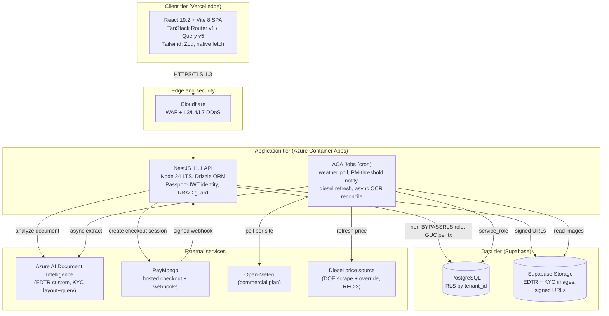
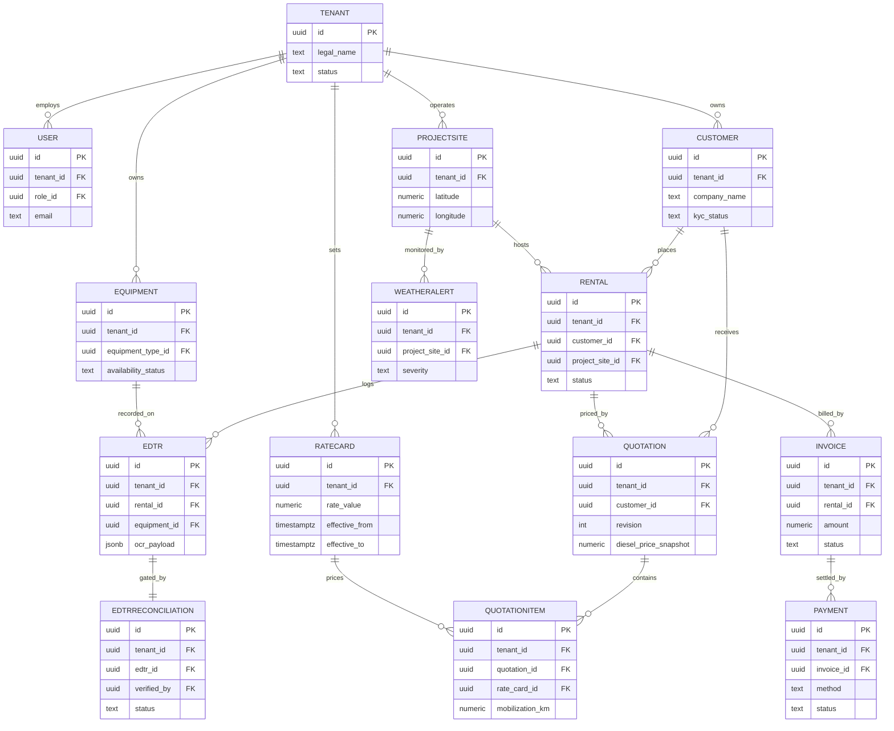
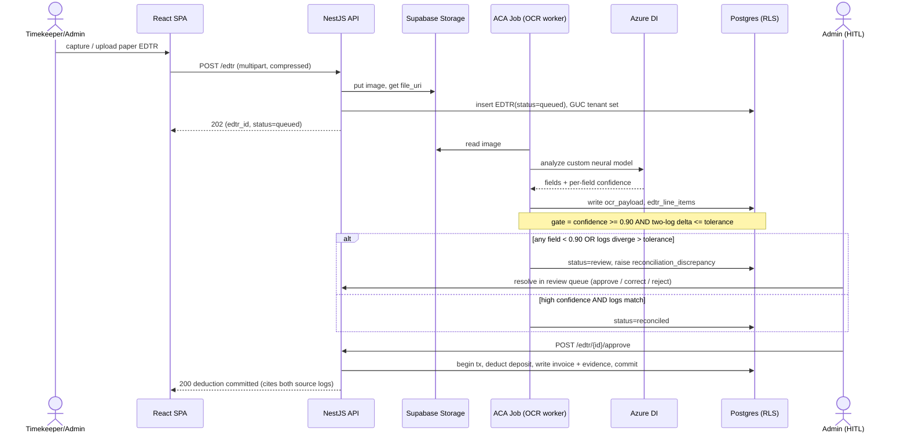
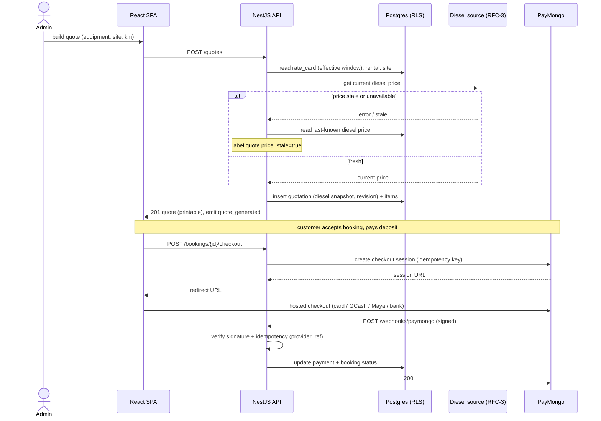

# System Design Document (SDD)

**Project:** ArkiLaunch (Web-Based Construction Equipment Rental Management System)
**Date:** 2026-07-25
**Version:** 0.1
**Owner:** ArkiLaunch Team (Almara Construction capstone)
**Status:** Draft
**Last reconciled:** N/A (not yet reconciled with code)
**PRD:** [prd-arkilaunch.md](prd-arkilaunch.md)
**Event / context:** FMD engine v1.28.1; Scale Full.

---

> **Note:** This SDD says *how* to build ArkiLaunch. The *what* and *for whom* live in the [PRD](prd-arkilaunch.md); the business case in the [BRD](brd-arkilaunch.md); the source idea in [idea-arkilaunch.md](idea-arkilaunch.md); verified claims and carried gaps in [scrutiny-arkilaunch.md](scrutiny-arkilaunch.md). Feature IDs `PRD-F1`..`PRD-F8` are frozen upstream and traced throughout. Non-obvious implementation is pushed into three forward RFCs: [rfc-arkilaunch-tenancy-rls-auth.md](rfc-arkilaunch-tenancy-rls-auth.md) (RFC-1, PRD-F7), [rfc-arkilaunch-ocr-edtr-reconciliation.md](rfc-arkilaunch-ocr-edtr-reconciliation.md) (RFC-2, PRD-F3), [rfc-arkilaunch-quotation-pricing-engine.md](rfc-arkilaunch-quotation-pricing-engine.md) (RFC-3, PRD-F1).

---

## 1. Architectural Vision & Principles

**Architecture style:** Three-tier web application. A React single-page app on Vercel edge, a persistent NestJS API plus scheduled workers on Azure Container Apps, and managed PostgreSQL plus object storage on Supabase. It is a modular monolith on the API side (clean NestJS module boundaries per feature), not microservices; the pilot serves one anchor tenant and a shared-schema pooled multi-tenant model, so a distributed topology would add cost without buying anything at this scale.

**Guiding principles:**
- **Back-end the paper, do not replace the field.** OCR the existing handwritten EDTR and reconcile it against a second independent log before any money moves. Digital entry is the primary path where a timekeeper will use it; OCR is the paper fallback (scrutiny §4).
- **No autonomous money movement.** Azure DI extracts; rules reconcile; a human approves. Deposit deduction is gated by a two-log match plus an explicit human approve. Extraction never decides and never bills on its own.
- **Tenant isolation is defense in depth, not a single guard.** Every query runs under an application-layer `tenant_id` filter *and* Postgres row-level security keyed on a transaction-scoped session variable. Either alone would be a single point of failure; both together are the design.
- **Fail loud in dev, degrade gracefully in prod.** External dependencies (Azure DI, Open-Meteo, PayMongo, the diesel source) each have a defined fallback and emit `external_dependency_degraded`. Unreadable OCR hard-fails to manual entry; it never fabricates a value.
- **Build for a cheap Android on 3 to 5 Mbps.** Compress before upload, chunk and resume, keep the UI responsive while OCR runs asynchronously.

**Key trade-offs made (explicit V1 tech debt):**
- **Shared-schema pooled multi-tenancy**, not schema-per-tenant or database-per-tenant. Cheapest to operate and correct at MSME scale; the debt is that a tenant demanding hard physical isolation forces a later migration path. Isolation rests on RLS correctness, so RLS is treated as security-critical and covered by RFC-1 and QAD abuse tests.
- **Single Postgres primary on Supabase, no read replicas in V1.** Acceptable for an anchor pilot under 10 daily active users; revisit before multi-tenant fan-out (BRD-M7).
- **No Redis in V1.** Refresh-token families, rate-limit counters, and short-lived caches live in Postgres and TanStack Query on the client. Add Redis if refresh-token revocation volume or rate-limit throughput demands it.
- **Diesel-price source resolved in RFC-3** (gap G-3 closed): a hybrid DOE scrape + platform/tenant manual override, cached as a last-known-price row. The quote engine is built against an interface, and the current price is snapshotted into every versioned quotation so pricing is reproducible regardless of source.
- **Analytics sink resolved in OPS §1**: a first-party `events` table on Supabase Postgres, not an external vendor, for the pilot (keeps PH-residency telemetry in-boundary; revisit PostHog only if analytics depth outgrows SQL). Event names are frozen in PRD §5.6 either way.

---

## 2. High-Level Architecture



**Layers:**

| Layer | Technology | Responsibility |
|-------|------------|----------------|
| Client | React 19.2 + Vite 8, TanStack Router v1 + Query v5, Tailwind, Zod, native fetch | Role-aware SPA (admin/owner/timekeeper/customer/platform); client-side image compression and resumable upload queue; printable quote output; never sees another tenant's data. Serves PRD-F1, F2, F3, F4, F5, F6, F7, F8 screens. |
| Edge / Gateway | Cloudflare (WAF, L3/L4/L7 DDoS), Vercel edge for static delivery | TLS 1.3 termination at the edge, WAF rules, DDoS absorption, bot mitigation on the public booking portal (`/t/:tenantSlug`). |
| API | NestJS 11.1 on Node 24 LTS (Azure Container Apps, persistent) | REST API, Passport-JWT identity authority, RBAC guard, per-request tenant transaction that sets the RLS GUC, PayMongo session creation and webhook verification, Azure DI extraction dispatch. Serves every PRD-F#. |
| Service / Compute | ACA Jobs (cron) on Node 24 | Weather poll per active site (PRD-F5), PM-threshold notifications (PRD-F4), diesel-price refresh (PRD-F1), async OCR + reconciliation workers (PRD-F3). Guards overlapping runs via replica/parallelism limit or an advisory lock. |
| Data | Supabase managed PostgreSQL + Supabase Storage; Drizzle ORM | Multi-tenant relational store with RLS by `tenant_id`; Storage holds EDTR and KYC image blobs behind short-TTL signed URLs. Not used as the session-auth authority. |
| Infrastructure | Vercel (frontend), Azure Container Apps (API + Jobs), Supabase (DB + Storage), Cloudflare (edge); external Azure DI, PayMongo, Open-Meteo, diesel source | Hosting, private DB networking, static egress IPs, secrets in env, CI/CD from `dev`/`staging`/`main`. Detailed in §6. |

---

## 3. Data Architecture

**Primary database:** PostgreSQL (Supabase managed) via **Drizzle ORM**; *reason: Drizzle gives first-class in-schema RLS through `pgPolicy` and `.rls()` queries, reviewable and diffable in TypeScript, which is safer for a system where tenant isolation is a security boundary (divergence from the thesis's Prisma; see build notes and RFC-1).*
**Secondary / cache:** None in V1. TanStack Query caches on the client; refresh-token families and rate-limit counters live in Postgres. *Reason: no cache tier earns its keep at anchor-pilot scale; Redis is a documented later add.*
**Vector store:** N/A. The AI component is document extraction (Azure DI), not retrieval; no embeddings.

The schema is the thesis's **29 core entities** extended for multi-tenancy with three additions, **Tenant (RentalCompany)**, **SubscriptionPlan**, and **Subscription**, for **32 tables**, plus three tables added by the forward RFCs: `refresh_tokens` ([RFC-1](rfc-arkilaunch-tenancy-rls-auth.md), tenant-owned token-family lineage), `diesel_price_readings` and `pricing_parameters` ([RFC-3](rfc-arkilaunch-quotation-pricing-engine.md), the diesel-index cache and per-tenant pricing inputs), for **35 tables total**. Design is normalized to 3NF: no repeating groups, every non-key attribute depends on the whole key, no transitive dependencies (for example addresses are factored into `Address` and joined through `CustomerAddress`, not inlined on `Customer`).

**Tenant scoping (closes scrutiny G-1: the thesis's 29-entity schema had no tenant model).** Seven tables sit outside tenant scope: `Tenant` (the tenant anchor itself; its `id` *is* the isolation key), the global RBAC catalog `Role` / `Permission` / `RolePermission`, the platform-wide `SubscriptionPlan` catalog, the shared `EquipmentType` reference, and `diesel_price_readings` (RFC-3; shared, public, non-PII fuel-price cache, same category as `EquipmentType`). The remaining **28 tenant-owned tables** each carry `tenant_id UUID NOT NULL` (the 26 here, plus `refresh_tokens` from RFC-1 and `pricing_parameters` from RFC-3). Almara is seeded as the anchor tenant. Platform-admin is a reserved role in the global RBAC catalog.

### Backend Schema

Full column definitions follow for the multi-tenant additions and the load-bearing billing cluster. A master catalog covering all 35 tables (32 here plus the 3 RFC-sourced additions) closes the section. Every tenant-owned table carries `tenant_id UUID NOT NULL` (FK to `tenants.id`, `ON DELETE RESTRICT`) plus `created_at TIMESTAMPTZ NOT NULL DEFAULT now()`; those two are omitted from the per-column tables below only to keep them readable, never from the migration.

**Table: `tenants`** (new; the RentalCompany anchor, not tenant-scoped)

| Column | Type | Null? | Default | Key / Index | Constraint |
|--------|------|-------|---------|-------------|------------|
| `id` | UUID | No | gen_random_uuid() | PK | this value is the tenant isolation key |
| `legal_name` | TEXT | No | | | rental company legal name |
| `slug` | TEXT | No | | UNIQUE idx | public catalog path `/t/:slug`, lowercased |
| `status` | TEXT | No | 'onboarding' | | onboarding, active, suspended |
| `kyc_state` | TEXT | No | 'unverified' | | unverified, submitted, verified |
| `created_at` | TIMESTAMPTZ | No | now() | | |

**Table: `subscription_plans`** (new; global catalog, not tenant-scoped)

| Column | Type | Null? | Default | Key / Index | Constraint |
|--------|------|-------|---------|-------------|------------|
| `id` | UUID | No | gen_random_uuid() | PK | |
| `code` | TEXT | No | | UNIQUE idx | plan code |
| `name` | TEXT | No | | | display name |
| `limits` | JSONB | No | '{}' | | fleet-size / seat caps (amounts live in UES, not here) |

**Table: `subscriptions`** (new; tenant-owned)

| Column | Type | Null? | Default | Key / Index | Constraint |
|--------|------|-------|---------|-------------|------------|
| `id` | UUID | No | gen_random_uuid() | PK | |
| `tenant_id` | UUID | No | | FK to `tenants.id`, idx | RESTRICT |
| `plan_id` | UUID | No | | FK to `subscription_plans.id` | |
| `status` | TEXT | No | 'trialing' | | trialing, active, past_due, canceled |
| `current_period_end` | TIMESTAMPTZ | No | | | |

**Table: `users`** (tenant-owned)

| Column | Type | Null? | Default | Key / Index | Constraint |
|--------|------|-------|---------|-------------|------------|
| `id` | UUID | No | gen_random_uuid() | PK | |
| `tenant_id` | UUID | No | | FK `tenants.id`, idx | RESTRICT |
| `role_id` | UUID | No | | FK `roles.id` | global catalog |
| `email` | TEXT | No | | UNIQUE idx (per tenant) | lowercased; `UNIQUE (tenant_id, email)` |
| `password_hash` | TEXT | No | | | argon2id, never logged |
| `status` | TEXT | No | 'active' | | active, disabled, locked |
| `totp_secret` | TEXT | Yes | | | 2FA for timekeepers; encrypted at rest |

**Table: `customers`** (tenant-owned)

| Column | Type | Null? | Default | Key / Index | Constraint |
|--------|------|-------|---------|-------------|------------|
| `id` | UUID | No | gen_random_uuid() | PK | |
| `tenant_id` | UUID | No | | FK `tenants.id`, idx | RESTRICT |
| `user_id` | UUID | Yes | | FK `users.id`, UNIQUE | optional for internal-only records |
| `company_name` | TEXT | No | | | |
| `kyc_status` | TEXT | No | 'pending' | | pending, approved, rejected |

**Table: `kyc_documents`** (tenant-owned; sensitive personal info under RA 10173)

| Column | Type | Null? | Default | Key / Index | Constraint |
|--------|------|-------|---------|-------------|------------|
| `id` | UUID | No | gen_random_uuid() | PK | |
| `tenant_id` | UUID | No | | FK `tenants.id`, idx | RESTRICT |
| `customer_id` | UUID | No | | FK `customers.id` | |
| `document_type` | TEXT | No | | | SEC cert, BIR form, etc. |
| `file_uri` | TEXT | No | | | Supabase Storage pointer, signed-URL access only |
| `ocr_payload` | JSONB | Yes | | | Azure DI structured output (SEC/TIN + regions) |
| `confidence` | NUMERIC(5,4) | Yes | | | min per-field extraction confidence |
| `status` | TEXT | No | 'pending' | | pending, needs_review, verified, rejected |

**Table: `equipment`** (tenant-owned)

| Column | Type | Null? | Default | Key / Index | Constraint |
|--------|------|-------|---------|-------------|------------|
| `id` | UUID | No | gen_random_uuid() | PK | |
| `tenant_id` | UUID | No | | FK `tenants.id`, idx | RESTRICT |
| `equipment_type_id` | UUID | No | | FK `equipment_types.id` | global reference |
| `model` | TEXT | No | | | |
| `serial_no` | TEXT | No | | UNIQUE idx (per tenant) | `UNIQUE (tenant_id, serial_no)` |
| `availability_status` | TEXT | No | 'available' | | available, deployed, maintenance |
| `runtime_hours` | NUMERIC(10,2) | No | 0 | | accrued from approved EDTRs; feeds maintenance threshold |

**Table: `rate_cards`** (tenant-owned; time-variant)

| Column | Type | Null? | Default | Key / Index | Constraint |
|--------|------|-------|---------|-------------|------------|
| `id` | UUID | No | gen_random_uuid() | PK | |
| `tenant_id` | UUID | No | | FK `tenants.id`, idx | RESTRICT |
| `equipment_type_id` | UUID | No | | FK `equipment_types.id` | |
| `rate_type` | TEXT | No | | | hourly, daily |
| `rate_value` | NUMERIC(12,2) | No | | | |
| `currency` | TEXT | No | 'PHP' | | ISO 4217 |
| `effective_from` | TIMESTAMPTZ | No | | idx (tenant_id, equipment_type_id, effective_from) | validity window start |
| `effective_to` | TIMESTAMPTZ | Yes | | | null means open-ended; time-variant history preserved, never overwritten |

**Table: `edtr`** (tenant-owned; one of two independent logs)

| Column | Type | Null? | Default | Key / Index | Constraint |
|--------|------|-------|---------|-------------|------------|
| `id` | UUID | No | gen_random_uuid() | PK | |
| `tenant_id` | UUID | No | | FK `tenants.id`, idx | RESTRICT |
| `rental_id` | UUID | No | | FK `rentals.id` | |
| `equipment_id` | UUID | No | | FK `equipment.id` | |
| `source` | TEXT | No | | | digital_entry or paper_ocr (which of the two logs) |
| `report_date` | DATE | No | | idx (equipment_id, report_date) | operational log date |
| `raw_file_uri` | TEXT | Yes | | | Storage pointer; null for direct digital entry |
| `ocr_payload` | JSONB | Yes | | | raw Azure DI extraction + per-field confidence |
| `status` | TEXT | No | 'queued' | | queued, extracting, extracted, review, reconciled, hard_failed (6 states; matches RFC-2 `edtr_status_chk`) |

**Table: `edtr_line_items`** (tenant-owned)

| Column | Type | Null? | Default | Key / Index | Constraint |
|--------|------|-------|---------|-------------|------------|
| `id` | UUID | No | gen_random_uuid() | PK | |
| `tenant_id` | UUID | No | | FK `tenants.id`, idx | RESTRICT |
| `edtr_id` | UUID | No | | FK `edtr.id` | |
| `hours_active` | NUMERIC(6,2) | No | | | revenue-generating hours; `>= 0` |
| `hours_idle` | NUMERIC(6,2) | No | | | idle hours; `>= 0` |
| `notes` | TEXT | Yes | | | |

**Table: `edtr_reconciliations`** (tenant-owned; the deposit-deduction gate)

| Column | Type | Null? | Default | Key / Index | Constraint |
|--------|------|-------|---------|-------------|------------|
| `id` | UUID | No | gen_random_uuid() | PK | |
| `tenant_id` | UUID | No | | FK `tenants.id`, idx | RESTRICT |
| `edtr_id` | UUID | No | | FK `edtr.id`, UNIQUE | one reconciliation per EDTR |
| `counterpart_edtr_id` | UUID | Yes | | FK `edtr.id` | the second independent log compared against |
| `delta_hours` | NUMERIC(6,2) | Yes | | | absolute difference between the two logs |
| `tolerance` | NUMERIC(6,2) | No | | | configured tenant tolerance (for example 0.25h) |
| `verified_by` | UUID | Yes | | FK `users.id` | human approver on HITL resolution |
| `adjustments` | JSONB | Yes | | | logged corrections for billing precision |
| `status` | TEXT | No | 'pending' | | pending, matched, discrepancy, approved, rejected |

**Table: `invoices`** (tenant-owned)

| Column | Type | Null? | Default | Key / Index | Constraint |
|--------|------|-------|---------|-------------|------------|
| `id` | UUID | No | gen_random_uuid() | PK | |
| `tenant_id` | UUID | No | | FK `tenants.id`, idx | RESTRICT |
| `rental_id` | UUID | No | | FK `rentals.id` | |
| `invoice_type` | TEXT | No | | | deposit_deduction, weekly, final |
| `amount` | NUMERIC(14,2) | No | | | |
| `status` | TEXT | No | 'draft' | | draft, issued, paid, void |
| `due_date` | TIMESTAMPTZ | No | | | |

**Table: `payments`** (tenant-owned; no card/account data stored)

| Column | Type | Null? | Default | Key / Index | Constraint |
|--------|------|-------|---------|-------------|------------|
| `id` | UUID | No | gen_random_uuid() | PK | |
| `tenant_id` | UUID | No | | FK `tenants.id`, idx | RESTRICT |
| `invoice_id` | UUID | No | | FK `invoices.id` | |
| `method` | TEXT | No | | | card, gcash, maya, bank (channel only) |
| `amount` | NUMERIC(14,2) | No | | | |
| `provider_ref` | TEXT | Yes | | UNIQUE idx | PayMongo payment reference; never a PAN/account no. |
| `status` | TEXT | No | 'pending' | | pending, paid, failed, refunded |

**Table: `weather_alerts`** (tenant-owned)

| Column | Type | Null? | Default | Key / Index | Constraint |
|--------|------|-------|---------|-------------|------------|
| `id` | UUID | No | gen_random_uuid() | PK | |
| `tenant_id` | UUID | No | | FK `tenants.id`, idx | RESTRICT |
| `project_site_id` | UUID | No | | FK `project_sites.id` | |
| `severity` | TEXT | No | | | risk level |
| `observed` | JSONB | Yes | | | conditions snapshot from the poll |
| `is_stale` | BOOLEAN | No | false | | true when served from cached last-known reading |
| `effective_at` | TIMESTAMPTZ | No | | | |
| `status` | TEXT | No | 'active' | | active, cleared |

**Table: `audit_logs`** (tenant-owned; append-only, immutable)

| Column | Type | Null? | Default | Key / Index | Constraint |
|--------|------|-------|---------|-------------|------------|
| `id` | UUID | No | gen_random_uuid() | PK | |
| `tenant_id` | UUID | No | | FK `tenants.id`, idx | RESTRICT |
| `actor_id` | UUID | No | | FK `users.id` | initiator |
| `action` | TEXT | No | | | CREATE, UPDATE, DELETE, APPROVE, DEDUCT |
| `entity` | TEXT | No | | | affected table name |
| `entity_id` | UUID | No | | | affected row id |
| `timestamp` | TIMESTAMPTZ | No | now() | idx | UTC |

`audit_logs` is append-only: no UPDATE or DELETE grant to the application role, enforced by a REVOKE plus a policy that permits INSERT and SELECT only. That immutability is what lets an invoice cite the exact reconciliation and both source logs behind a deduction.

**Master catalog (all 35 tables).** Detailed above are the additions and billing cluster; the rest follow the same conventions (UUID PK, `tenant_id` where tenant-owned, FKs as noted). Rows 33 to 35 are defined in the forward RFCs, not above; they are cataloged here so this stays the single count of record.

| # | Table | Tenant-scoped? | PK | Key FKs | Notes |
|---|-------|----------------|----|---------|-------|
| 1 | `tenants` | anchor (self) | id | | isolation key; +slug, status, kyc_state |
| 2 | `subscription_plans` | No (global) | id | | +code, name, limits |
| 3 | `subscriptions` | Yes | id | tenant_id, plan_id | +status, current_period_end |
| 4 | `roles` | No (global) | id | | +name |
| 5 | `permissions` | No (global) | id | | +code, description |
| 6 | `role_permissions` | No (global) | id | role_id, permission_id | RBAC join |
| 7 | `users` | Yes | id | tenant_id, role_id | +email, password_hash, status, totp_secret |
| 8 | `customers` | Yes | id | tenant_id, user_id | +company_name, kyc_status |
| 9 | `customer_contacts` | Yes | id | tenant_id, customer_id | +contact_type, contact_value, is_primary |
| 10 | `addresses` | Yes | id | tenant_id | +line1/2, city, province, postal_code, country |
| 11 | `customer_addresses` | Yes | id | tenant_id, customer_id, address_id | +address_type |
| 12 | `kyc_documents` | Yes | id | tenant_id, customer_id | +file_uri, ocr_payload, confidence, status |
| 13 | `equipment_types` | No (global) | id | | shared reference catalog; +name |
| 14 | `equipment` | Yes | id | tenant_id, equipment_type_id | +serial_no, availability_status, runtime_hours |
| 15 | `rate_cards` | Yes | id | tenant_id, equipment_type_id | time-variant (effective_from/to) |
| 16 | `project_sites` | Yes | id | tenant_id, address_id | +latitude, longitude (weather poll) |
| 17 | `rentals` | Yes | id | tenant_id, customer_id, project_site_id | +status, start_date, end_date |
| 18 | `quotations` | Yes | id | tenant_id, customer_id, rental_id | +revision, status, diesel_price_snapshot, price_stale |
| 19 | `quotation_items` | Yes | id | tenant_id, quotation_id, equipment_type_id, rate_card_id | +quantity, mobilization_km, demobilization_km |
| 20 | `rental_contracts` | Yes | id | tenant_id, quotation_id | +deposit_required, terms_ref, status |
| 21 | `equipment_assignments` | Yes | id | tenant_id, equipment_id, rental_id | +start, end, status (double-book guard) |
| 22 | `edtr` | Yes | id | tenant_id, rental_id, equipment_id | +source, ocr_payload, status |
| 23 | `edtr_line_items` | Yes | id | tenant_id, edtr_id | +hours_active, hours_idle, notes |
| 24 | `edtr_reconciliations` | Yes | id | tenant_id, edtr_id, counterpart_edtr_id, verified_by | the deduction gate |
| 25 | `invoices` | Yes | id | tenant_id, rental_id | +invoice_type, amount, status, due_date |
| 26 | `invoice_line_items` | Yes | id | tenant_id, invoice_id | +description, quantity, unit_price, amount |
| 27 | `payments` | Yes | id | tenant_id, invoice_id | +method, provider_ref, status |
| 28 | `maintenance_schedules` | Yes | id | tenant_id, equipment_id | +hours_interval, next_due |
| 29 | `maintenance_logs` | Yes | id | tenant_id, equipment_id | +performed_at, notes |
| 30 | `weather_alerts` | Yes | id | tenant_id, project_site_id | +severity, observed, is_stale, status |
| 31 | `notifications` | Yes | id | tenant_id, user_id | +notification_type, payload, status |
| 32 | `audit_logs` | Yes | id | tenant_id, actor_id | append-only, immutable |
| 33 | `refresh_tokens` | Yes | id | tenant_id, user_id, parent_id | RFC-1; token-family lineage, hashed tokens |
| 34 | `diesel_price_readings` | No (global) | id | | RFC-3; DOE-scrape + manual-entry price cache |
| 35 | `pricing_parameters` | Yes | id | tenant_id | RFC-3; time-variant per-tenant pricing inputs |

**Key relationships:**
- Tenant has many Users, Customers, Equipment, RateCards, ProjectSites, Subscriptions (1:N), and is the isolation root for every tenant-owned row.
- Customer has many Rentals, Quotations, KYCDocuments (1:N); a Rental belongs to one Customer and one ProjectSite.
- Quotation has many QuotationItems (1:N); each item prices against one RateCard (time-variant) and one EquipmentType.
- Rental has many EDTRs and many Invoices (1:N); each EDTR has many EDTRLineItems and exactly one EDTRReconciliation (1:1) that gates the deduction.
- Invoice has many Payments (1:N); ProjectSite has many WeatherAlerts (1:N).
- Role has many Permissions through RolePermission (M:N), global across tenants.

**Entity relationship diagram** (core cluster, 14 entities):



**Tenant isolation (shared schema + RLS by tenant_id).** All tenants share one schema and one set of tables. Isolation is enforced two ways at once:

1. **Application filter.** Every Drizzle query for a tenant-owned table is scoped by `tenant_id` from the authenticated JWT. This is the first line and keeps query plans honest.
2. **Postgres RLS.** Each tenant-owned table has RLS **enabled and forced**, with a `tenant_isolation` policy scoped `FOR ALL TO app_authenticated` carrying both `USING` and `WITH CHECK` clauses of the form `tenant_id = current_setting('app.current_tenant_id', true)::uuid` (the `true` argument is `missing_ok`, which makes an unset GUC return zero rows rather than erroring or exposing all rows). The application connects on a dedicated **non-BYPASSRLS** Postgres role, so the database itself refuses to return another tenant's rows even if the app filter is ever missed. This is the coarse backstop. The exact DDL, and why every one of these five elements (`FORCE`, `TO app_authenticated`, `USING`, `WITH CHECK`, `missing_ok`) is load-bearing, lives in [RFC-1](rfc-arkilaunch-tenancy-rls-auth.md) §3; every tenant-owned table added by any RFC or migration must match that pattern exactly, not a partial form.

**The GUC pattern.** The API opens a request-scoped ORM transaction and, before any query, runs `set_config('app.current_tenant_id', <jwt.tenant_id>, true)` (and `app.current_user_id`, `app.current_role`) with `local = true` so the setting is transaction-scoped and cannot leak across pooled connections. RLS reads those GUCs. We connect directly to Postgres (Supabase here is managed Postgres plus Storage, not the session-auth authority), so policies key off our injected GUCs, not Supabase Auth `auth.uid()`. `service_role` (which bypasses RLS) is reserved for migrations and trusted cron jobs only; the request path never uses it. The deep design, policy DDL, connection-pool safety, and the reuse-detection interaction live in **[RFC-1](rfc-arkilaunch-tenancy-rls-auth.md)**.

**Indexes & performance:** `tenant_id` is the leading column on every tenant-owned index, since every query filters on it first. Composite indexes worth calling out: `rate_cards (tenant_id, equipment_type_id, effective_from)` for the time-variant lookup at quote time; `edtr (tenant_id, equipment_id, report_date)` for pairing the two independent logs; `payments (provider_ref)` UNIQUE for webhook idempotency; `audit_logs (tenant_id, timestamp)` for the evidence trail. Everything else is PK/FK lookup.

**Migration strategy:** Drizzle migrations, forward-only, **expand/contract** so every migration is backward-compatible for one release and the prior tagged build runs against the new schema (this is what makes the §9 rollback safe). Migrations and cron run under `service_role`; the request path never gets DDL rights. RLS policies ship in the same migration as the table they protect.

**Caching strategy:** No server cache tier in V1. Client-side: TanStack Query with per-resource staleness. Server-side: the last-known Luzon weather reading and the last-known diesel price are persisted rows (not an in-memory cache) so a cold worker restart still has the fallback value. Add Redis later if refresh-token or rate-limit throughput demands it.

---

## 4. API Design & External Integrations

**API style:** REST over HTTPS, JSON, versioned under `/api/v1`. Passport-JWT bearer auth; every tenant route runs inside the RLS transaction described in §3. Request and response bodies validated with Zod (shared client/server schemas via `nestjs-zod` under evaluation).

**OpenAPI / contract source:** Inline below for Must-Have paths; the OCR pipeline contract is detailed in [RFC-2](rfc-arkilaunch-ocr-edtr-reconciliation.md) and the quotation/diesel contract in [RFC-3](rfc-arkilaunch-quotation-pricing-engine.md).

**Internal endpoints (high-level):**

| Method | Path | Purpose | Feature |
|--------|------|---------|---------|
| `POST` | `/api/v1/auth/login` | Password + optional 2FA, issue access + refresh | PRD-F7 |
| `POST` | `/api/v1/auth/refresh` | Rotate refresh token, reuse detection | PRD-F7 |
| `POST` | `/api/v1/quotes` | Generate diesel-indexed quote | PRD-F1 |
| `GET` | `/api/v1/quotes/:id` | Retrieve printable quote | PRD-F1 |
| `POST` | `/api/v1/edtr` | Upload EDTR image or digital entry, queue OCR | PRD-F3 |
| `POST` | `/api/v1/edtr/:id/approve` | Approve reconciled record, deduct deposit | PRD-F3 |
| `POST` | `/api/v1/kyc/extract` | Extract SEC number + TIN from corporate doc | PRD-F6 |
| `GET` | `/api/v1/sites/:id/weather` | Current advisory + conditions for a site | PRD-F5 |
| `POST` | `/api/v1/bookings` | Create a tenant-scoped booking | PRD-F8 |
| `GET` | `/api/v1/bookings` | List bookings (own, if `customer`; tenant-wide for staff) | PRD-F8 |
| `GET` | `/api/v1/bookings/:id` | Transaction tracker (order/payment/rental status) | PRD-F8 |
| `PATCH` | `/api/v1/bookings/:id/cancel` | Cancel a booking, freeing its equipment_assignments | PRD-F8 |
| `POST` | `/api/v1/bookings/:id/checkout` | Create PayMongo hosted-checkout session | PRD-F2 |
| `POST` | `/api/v1/webhooks/paymongo` | Payment status webhook (signed, idempotent) | PRD-F2 |
| `POST` | `/internal/jobs/weather-poll` | Cron: poll Open-Meteo per active site | PRD-F5 |
| `GET` | `/api/v1/equipment` | List fleet inventory with availability status | PRD-F4 |
| `GET` | `/api/v1/equipment/:id/maintenance` | Maintenance schedule + log history for one unit | PRD-F4 |
| `POST` | `/api/v1/equipment/:id/maintenance-logs` | Record a completed maintenance action | PRD-F4 |
| `GET` | `/api/v1/reports/utilization` | Fleet utilization + runtime-hours report | PRD-F4 |
| `POST` | `/internal/jobs/maintenance-threshold-notify` | Cron: check `runtime_hours` against `maintenance_schedules` and notify | PRD-F4 |
| `GET` | `/api/v1/edtr` | Review queue: filterable, paginated, timekeepers see only assigned sites (`cr-arkilaunch-f9-read-surface.md`) | PRD-F3 |
| `POST` | `/api/v1/edtr/:id/reject` | Reject a reconciliation without deducting (`cr-arkilaunch-f9-read-surface.md`) | PRD-F3 |
| `GET` | `/api/v1/invoices`, `GET /api/v1/invoices/:id` | Invoice list/detail with the EDTR deduction evidence trail (`cr-arkilaunch-f9-read-surface.md`) | PRD-F2/F3 |
| `GET` | `/api/v1/rentals/:id/deposit` | Deposit ledger: configured cap, deductions, remaining balance (`cr-arkilaunch-f9-read-surface.md`) | PRD-F2/F3 |
| `GET`/`POST`/`PATCH` | `/api/v1/sites`, `/api/v1/sites/:id` | Site list/create/update (`cr-arkilaunch-f9-read-surface.md`) | PRD-F4 |
| `POST` | `/api/v1/sites/:id/deployments` | Deploy equipment to a site (reuses the booking overlap/lock check) | PRD-F4 |
| `PATCH` | `/api/v1/sites/:id/deployments/:assignmentId/return` | Return deployed equipment | PRD-F4 |
| `GET` | `/api/v1/weather/advisories` | Active advisories across every tenant site | PRD-F5 |
| `GET` | `/api/v1/incidents` | Liability incident log, read from `events` (no new table) | PRD-F5 |
| `GET` | `/api/v1/notifications`, `PATCH /api/v1/notifications/:id/read` | The caller's own notifications feed (`cr-arkilaunch-f9-read-surface.md`) | cross-cutting |
| `GET` | `/api/v1/reports/financial` | Invoiced/paid/deducted totals by period (QAD-T8's financial half) | PRD-F4 |

### Must-Have endpoint contracts

### `POST /api/v1/quotes` · PRD-F1

```
Request:
{
  "customer_id": uuid,
  "project_site_id": uuid,
  "items": [
    { "equipment_type_id": uuid, "quantity": int>=1, "rate_card_id": uuid,
      "mobilization_km": number, "demobilization_km": number }
  ]
}

Response 201:
{
  "id": uuid,
  "revision": int,
  "status": "draft",
  "diesel_price": number,
  "diesel_price_date": "YYYY-MM-DD",
  "price_stale": bool,          // true when last-known price used
  "line_items": [ { "equipment_type_id": uuid, "hourly_rate": number,
                    "mobilization_cost": number, "demobilization_cost": number,
                    "subtotal": number } ],
  "total": number,
  "printable_url": string
}
```
Stale-price path returns `price_stale: true` and the price date rather than pricing silently against an unknown value (US-03). Pricing math and diesel source in [RFC-3](rfc-arkilaunch-quotation-pricing-engine.md).

### `POST /api/v1/edtr` · PRD-F3

```
Request (multipart/form-data):
  rental_id: uuid
  equipment_id: uuid
  source: "paper_ocr" | "digital_entry"
  report_date: "YYYY-MM-DD"
  file: binary            // required for paper_ocr; compressed client-side
  line_items: json        // required for digital_entry (hours_active, hours_idle)

Response 202:
{
  "id": uuid,
  "status": "queued",      // digital_entry returns "extracted"
  "source": "paper_ocr",
  "poll_url": "/api/v1/edtr/{id}"
}
```
Returns 202 immediately; extraction runs on the async worker so the UI never blocks. Unreadable input later transitions `status: "hard_failed"` and routes to manual entry; never fabricates a value.

### `POST /api/v1/edtr/:id/approve` · PRD-F3 (reconcile then deduct)

```
Request:
{
  "reconciliation_id": uuid,
  "adjustments": { ... } | null    // optional human corrections
}

Response 200:
{
  "reconciliation": { "id": uuid, "status": "approved",
                      "delta_hours": number, "tolerance": number },
  "invoice_line": { "invoice_id": uuid, "hours": number,
                    "source_logs": [uuid, uuid] },
  "deposit": { "balance_before": number, "deducted": number, "balance_after": number }
}

Response 409 (gate not held):
{ "error": "reconciliation_discrepancy",
  "delta_hours": number, "tolerance": number }
```
The deduction commits only when the reconciliation status is `matched` (or human-resolved) AND a human approves. A discrepancy returns 409 and deducts nothing (US-01). Double-entry logic in [RFC-2](rfc-arkilaunch-ocr-edtr-reconciliation.md).

### `POST /api/v1/kyc/extract` · PRD-F6

```
Request (multipart/form-data):
  customer_id: uuid
  document_type: string
  file: binary

Response 202:
{
  "kyc_document_id": uuid,
  "status": "queued"
}

Later GET /api/v1/kyc/{id} →
{
  "status": "needs_review" | "verified" | "rejected",
  "extracted": { "sec_number": string, "tin": string },
  "confidence": { "sec_number": number, "tin": number },
  "requires_human_confirmation": true    // always true; portal check is manual
}
```
Uses Azure DI layout + query fields, not the prebuilt `idDocument` model (which covers only US licenses and passports; scrutiny FC-5). Values below threshold or unmatched on the SEC/BIR portals keep the tenant unverified; ORUS CAPTCHA forces the human step (US-06).

### `GET /api/v1/sites/:id/weather` · PRD-F5

```
Response 200:
{
  "site_id": uuid,
  "observed": { "temp_c": number, "wind_kph": number,
                "precip_mm": number, "code": int },
  "advisory": { "severity": "none"|"watch"|"warning", "message": string },
  "is_stale": bool,           // true when cached last-known reading served
  "polled_at": timestamptz
}
```
The `POST /internal/jobs/weather-poll` cron writes `weather_alerts` and auto-logs a liability incident when a risk threshold is crossed. Open-Meteo down returns the cached last-known Luzon reading with `is_stale: true`; the cycle retries and alerts rather than dropping silently (US-05).

### `POST /api/v1/bookings` · PRD-F8

```
Request:
{
  "customer_id": uuid,
  "project_site_id": uuid,
  "items": [ { "equipment_id": uuid, "start": ts, "end": ts } ]
}

Response 201:
{ "id": uuid, "status": "pending", "tracker_url": "/orders/{id}" }

Response 409:
{ "error": "equipment_unavailable", "equipment_id": uuid,
  "alternatives": [uuid] }
```
Availability is checked against `equipment_assignments`; an unavailable unit returns 409 with alternatives and never overbooks (US-09).

### `POST /api/v1/webhooks/paymongo` · PRD-F2

```
Headers: Paymongo-Signature: t=<ts>,te=<test_sig>,li=<live_sig>   // verified before body parse
Request (PayMongo event envelope):
{ "data": { "attributes": { "type": "payment.paid"|"payment.failed"|"refund.succeeded"|"dispute.created"|"dispute.resolved",
             "data": { "id": string, "attributes": { "amount": int,
                       "status": string, "metadata": {"invoice_id": string} } } } } }

Response 200: { "received": true }   // 2xx only after durable write
```
Signature verified with the endpoint secret before any processing (`<t>.<raw_body>` HMAC-SHA256, compared against `li`/`te`); `provider_ref` UNIQUE makes replays idempotent; booking/payment status comes from the webhook, not the browser redirect (US-08). Non-2xx tells PayMongo to retry. Webhook/idempotency/refund detail is a carried gap (G-10), resolved directly below (no dedicated RFC; see scrutiny §3 G-10). **Event names corrected 2026-08-02** (`cr-arkilaunch-f2-f8-bookings-payments.md`) against live-verified PayMongo docs: `refund.succeeded` and split `dispute.created`/`dispute.resolved` events, not the `refund.updated`/single-"dispute" placeholder this contract originally sketched.

### `GET /api/v1/equipment` · `GET /api/v1/equipment/:id/maintenance` · PRD-F4

```
GET /api/v1/equipment?status=available|deployed|maintenance

Response 200:
{
  "items": [ { "id": uuid, "equipment_type_id": uuid, "model": string,
               "serial_no": string, "availability_status": string,
               "runtime_hours": number } ],
  "total": int
}

GET /api/v1/equipment/:id/maintenance

Response 200:
{
  "schedule": { "hours_interval": number, "next_due": number },
  "runtime_hours": number,
  "logs": [ { "id": uuid, "performed_at": timestamptz, "notes": string } ]
}
```

### `POST /api/v1/equipment/:id/maintenance-logs` · PRD-F4

```
Request: { "performed_at": timestamptz, "notes": string }

Response 201:
{ "id": uuid, "equipment_id": uuid, "performed_at": timestamptz }
```
Recording a maintenance log resets the unit's threshold countdown against `maintenance_schedules.hours_interval`; gated by the `fleet:manage` permission (RBAC guard, RFC-1).

### `GET /api/v1/reports/utilization` · PRD-F4

```
Response 200:
{
  "period": { "from": "YYYY-MM-DD", "to": "YYYY-MM-DD" },
  "fleet": [ { "equipment_id": uuid, "runtime_hours": number,
               "utilization_pct": number, "maintenance_due": bool } ]
}
```
Aggregates `equipment.runtime_hours` and `edtr`/`edtr_line_items` over the period; read-only, tenant-scoped like every other route.

**PM-threshold notification (cron, PRD-F4).** `POST /internal/jobs/maintenance-threshold-notify` runs on the ACA Jobs schedule (SDD §2/§6, `service_role`), compares each tenant's `equipment.runtime_hours` against its `maintenance_schedules.hours_interval`, and writes a `notifications` row when a unit crosses its threshold. No money movement and no autonomous state change: it notifies, a human schedules the maintenance.

**PayMongo webhook idempotency, refunds, and disputes (G-10, resolved here; no dedicated RFC needed).** The `POST /api/v1/webhooks/paymongo` contract above already gives idempotency (`provider_ref` UNIQUE, signature verified before body processing, status derived from the webhook and never the browser redirect). This closes the remaining detail scrutiny G-10 asked for:
- **Idempotency:** a replayed webhook with an already-seen `provider_ref` is a no-op 200 (write is `INSERT ... ON CONFLICT (provider_ref) DO NOTHING`), never a duplicate payment or double deduction.
- **Refunds:** a refund is a distinct PayMongo event (`refund.succeeded`, corrected 2026-08-02 per `cr-arkilaunch-f2-f8-bookings-payments.md` §5 against live-verified docs; this line's earlier `refund.updated` was the last stale reference, fixed by `cr-arkilaunch-f9-read-surface.md`) carrying its own `id`; it is stored as a new `payments` row (`method` unchanged, `status='refunded'`) linked to the original via `invoice_id`, never by mutating the original row (audit-log immutability, SDD §3).
- **Disputes:** a chargeback/dispute webhook flips the invoice to a `disputed` state (extends the `invoices.status` enum) and routes to the admin queue for manual resolution; ArkiLaunch does not auto-refund or auto-void on a dispute notification.
- **Testing:** covered by `QAD-T15` (stale/webhook fallback) plus the new isolation/authz coverage in `QAD-T43`..`T48`; abuse coverage (replay, forged signature) is in QAD §3.4 F2 row.

### 4.1 Runtime sequences

**(a) EDTR OCR to double-entry reconciliation to deposit deduction (PRD-F3).** Detail in [RFC-2](rfc-arkilaunch-ocr-edtr-reconciliation.md).



**(b) Quote generation with live diesel price to PayMongo hosted checkout to webhook status (PRD-F1 + PRD-F2).** Quotation/diesel detail in [RFC-3](rfc-arkilaunch-quotation-pricing-engine.md).



**External integrations:**

| Service | Purpose | Rate Limits / Fallback |
|---------|---------|------------------------|
| Azure AI Document Intelligence | EDTR extraction (F3), KYC SEC/TIN extraction (F6) | Async queue + retry with backoff; unreadable input hard-fails to manual entry, never fabricates; per-page priced. SE Asia region / residency is a carried gap (AIA §5 + CLR). Emits `external_dependency_degraded`. |
| PayMongo | Hosted checkout + deposit webhooks (F2) | 429 backoff; webhook signature-verified + idempotent on `provider_ref`; status derived from webhook not redirect. Refund/dispute detail carried (G-10). |
| Open-Meteo (commercial plan) | Per-site weather poll (F5) | Commercial plan required (free tier is non-commercial; FC-7). Serve cached last-known Luzon reading on outage, mark `is_stale`, retry and alert, never drop the cycle silently. |
| Diesel price source (RFC-3) | Live diesel index for quotes (F1) | Source resolved (G-3 closed): hybrid DOE scrape + platform/tenant manual override. Snapshot price into each versioned quotation; on stale/unavailable use last-known with a staleness warning; full design in [RFC-3](rfc-arkilaunch-quotation-pricing-engine.md). |
| Supabase Storage | EDTR + KYC image blobs (F3/F6) | Short-TTL signed URLs; access mediated by API; RLS on metadata rows; images never served on a public URL. |

---

## 5. Security & Authorization

**Authentication:** NestJS + Passport-JWT is the single identity authority (PRD-F7). Supabase Auth/GoTrue is not the session authority. Passwords hashed with **argon2id**. Timekeepers enroll 2FA (TOTP) and pass an active-site check before submitting EDTRs.

**Session management:** Short-lived access token (carries `tenant_id` and `role`, minutes-scale TTL) plus a rotating refresh token. Refresh rotation uses **reuse detection**: replaying an already-rotated token revokes the whole token family (US-07). JWT verification runs an **algorithm allowlist** (asymmetric signature only; `alg: none` and algorithm-confusion rejected). Token families are stored in Postgres for V1.

**Authorization model:** Two enforced layers.
- **RBAC guard.** A NestJS guard resolves the user's Role and its Permissions (global `roles` / `permissions` / `role_permissions` catalog) and gates every sensitive route by permission code. Owner cannot data-enter; timekeeper cannot reach `/app/kyc` or `/app/settings/*`; platform-admin is a reserved role (US-10).
- **Postgres RLS as the tenant/row backstop.** The app runs on a dedicated **non-BYPASSRLS** Postgres role. Each request opens a transaction that injects `app.current_tenant_id` (and `current_user_id`, `current_role`) via `set_config(..., true)` before any query; RLS policies filter every tenant-owned row against that GUC. `service_role` (BYPASSRLS) is reserved for migrations and trusted cron only, never the request path. A Tenant A user crafting a request for Tenant B's data gets zero rows from the database itself, and the attempt is logged (`cross_tenant_access_denied`). Design in [RFC-1](rfc-arkilaunch-tenancy-rls-auth.md).

**Tenant isolation is defense in depth:** the application-layer `tenant_id` filter and RLS both run on every tenant query. Neither is trusted alone.

**Data protection:**
- PII / sensitive data: KYC and ID document images are sensitive personal information under RA 10173. Data minimization at capture, short-TTL signed URLs, retention limits, and region residency (SE Asia target); no PII (raw SEC/TIN, card/account numbers, ID images) in logs or analytics property values. Detail in the CLR.
- Payments: PayMongo hosted checkout keeps card/account data out of our boundary entirely (no PAN/account stored; PCI-DSS L1 on PayMongo's side). We store only the returned `provider_ref` and status.
- Secrets management: environment variables per platform (Vercel, Azure Container Apps, Supabase); never committed. Azure DI keys, PayMongo secret, Open-Meteo key, DB creds live in env only.
- Input validation: Zod schemas on all API inputs (shared with the client where practical); Drizzle parameterized queries (no string-built SQL).
- Webhooks: PayMongo signature verified before body processing; idempotency on `provider_ref` UNIQUE.
- Transport: HTTPS everywhere, TLS 1.3 terminated at Cloudflare; private networking to the DB; static egress IPs; WAF and L3/L4/L7 DDoS at the edge.

---

## 6. Infrastructure, CI/CD & Deployment

**Hosting:** Vercel (React frontend), Azure Container Apps (persistent NestJS API + ACA Jobs cron/workers), Supabase (PostgreSQL + Storage), Cloudflare (WAF + DDoS + TLS 1.3). This corrects the naive "backend on Vercel serverless" reading: serverless cannot run the scheduler or the async OCR/reconciliation workers (scrutiny G-6), so the backend is a persistent host and Vercel keeps the frontend only.

**Environments:**
- `dev`: Local Docker Compose (Postgres + API) mirroring the prod schema; feature branches off `dev`. Azure DI, PayMongo, Open-Meteo run against sandbox/test keys.
- `staging`: `staging` branch deploys to a Vercel preview + an ACA staging revision + a Supabase staging project. Full integration, including PayMongo test webhooks and Playwright E2E.
- `prod`: `main` branch deploys to Vercel production + ACA production + the production Supabase project, behind Cloudflare. Anchor tenant (Almara) only during the pilot, module by module behind per-feature flags.

**CI/CD:** GitHub Actions on push/PR: lint, type-check, Vitest unit, Drizzle migration check (expand/contract compatibility), Postman/Newman API suite, Playwright E2E on the two load-bearing flows (OCR to reconciliation to deduction; quote to payment, including sad and abuse paths). Merge to `staging` deploys staging; a tagged release on `main` deploys prod. The CI pipeline is the single source of truth for what is live (feeds the §9 rollback).

**Edge / weather / diesel operational notes:**
- Cloudflare WAF fronts every public route; the booking portal (`/t/:tenantSlug`) additionally gets bot mitigation.
- **Open-Meteo commercial plan** (the free tier is non-commercial, up to 10k/day, CC BY 4.0; ArkiLaunch is commercial, FC-7). Quota and cost alerting live in OPS. Fallback: the last-known Luzon reading persisted per site, served with `is_stale: true`.
- **Diesel-price source is resolved** (G-3 closed) in [RFC-3](rfc-arkilaunch-quotation-pricing-engine.md): hybrid DOE scrape + manual override. The current price is snapshotted into each quotation for reproducibility regardless of source.
- ACA Jobs guard overlapping cron runs via a replica/parallelism limit or a Postgres advisory lock.

**Backup & disaster recovery:**
- Backup cadence: Supabase automated daily snapshots with point-in-time recovery on the paid tier; 30-day retention. KYC/ID image blobs in Storage backed up on the same cadence with retention limits per RA 10173.
- **RTO** (max acceptable downtime): 4h. **RPO** (max acceptable data loss): 24h (tightened by PITR where enabled).
- Restore tested: a restore drill is run in M5 before go-live and rehearsed with the rollback; a backup never restored is not a backup.
- Rollback: redeploy the previous tagged release from CI. Migrations follow the **expand/contract** pattern so they stay backward-compatible for one release and the prior build runs against the current schema. Per-module feature flags disable a single failing module (for example weather or booking) without a full redeploy.

---

## 7. Non-Functional Requirements

| ID | Requirement | Target | Notes |
|----|-------------|--------|-------|
| `NFR-1` | API response (p95) | < 400 ms for tenant CRUD reads/writes | Excludes async OCR and external calls; measured at the API, inside the RLS transaction. |
| `NFR-2` | Quote generation (end to end) | < 60 s (US-03), typically < 5 s | Diesel price cached/snapshotted; PRD-F1. Feeds BRD-M4. |
| `NFR-3` | OCR extraction (async) | seconds to ~60 s per document | Azure DI on the worker; UI shows queued/processing and never blocks; PRD-F3. |
| `NFR-4` | Weather poll cadence | every 30 min per active site | ACA Job; risk crossing auto-logs a liability incident; PRD-F5. |
| `NFR-5` | Uptime (core modules) | 99.5% | BRD-M6; excludes third-party outages that have a working fallback. Traced to OPS `SLO-1`. |
| `NFR-6` | Max concurrent users (V1) | 50 | Anchor pilot runs under 10 daily active; single Postgres primary is sufficient. |
| `NFR-7` | Client on 3 to 5 Mbps | first meaningful paint < 3 s on a 3G-class link | Code-splitting, image compression before upload; UX constraint PRD §5.5. |
| `NFR-8` | Large upload handling | resumable, compressed, retry that preserves entered data | Offline queue for the timekeeper; MUST NOT lose entered data (US-02). |
| `NFR-9` | Data retention | KYC/ID images minimized + retention-limited (RA 10173); audit logs immutable and long-lived; app logs 30 to 90 days | Final retention set by CLR §1. |
| `NFR-10` | Fleet report generation (PRD-F4) | `GET /reports/utilization` p95 < 1 s over a single tenant's fleet | Aggregation query over indexed `equipment`/`edtr` rows; no async job required at anchor-pilot fleet size. |
| `NFR-11` | Localization | All timestamps and scheduled jobs (weather poll, diesel refresh, PM notifications) run against `Asia/Manila`; currency formatting is PHP throughout; no additional locale for V1 | PH-only market for V1 (PRD §5.7 `PRD-NFR7`). Store all timestamps as `TIMESTAMPTZ` (UTC at rest, per SDD §3); render in `Asia/Manila` at the API/client boundary, never assume server local time. |

**ISO/IEC 25010 mapping.** UAT is scored against ISO/IEC 25010 (BRD-M5, UAT mean >= 3.41, 5-point Likert per G-7). A version note carries forward: the thesis uses the **2011** 8-characteristic model; **25010:2023** has 9 characteristics (adds Safety) and renames Usability to Interaction Capability and Portability to Flexibility. **The QAD chooses** which to instrument and records the choice; this SDD maps NFRs to both readings.

| ISO/IEC 25010 characteristic | ArkiLaunch NFR evidence |
|------------------------------|-------------------------|
| Functional Suitability | Must-Have acceptance criteria (US-01..US-10) pass |
| Performance Efficiency | p95 < 400 ms; quote < 60 s; OCR async budget |
| Reliability | 99.5% uptime; graceful degradation with fallbacks and `external_dependency_degraded` |
| Security | JWT rotation + reuse detection, RLS tenant isolation, argon2id, TLS 1.3 (§5) |
| Interaction Capability (2023) / Usability (2011) | works on cheap Android over 3 to 5 Mbps; data-dense, high-contrast |
| Maintainability | modular NestJS boundaries, Drizzle migrations, typed schema |
| Flexibility (2023) / Portability (2011) | containerized API on ACA; managed Postgres |
| Compatibility | REST/JSON; standard PayMongo, Open-Meteo, Azure DI contracts |
| Safety (2023, new) | no autonomous money movement; reconciliation gate + HITL; unreadable hard-fails to manual |

NFR-to-OPS traceability: `NFR-1`/`NFR-2` -> OPS `SLO-2`/`SLO-3` (latency burn alerting); `NFR-3` -> OPS `SLO-4`/`SLO-5` (OCR success rate + queue latency); `NFR-4` -> OPS `SLO-8`; `NFR-5` -> OPS `SLO-1`; `NFR-9` -> CLR §1 retention schedule. See [ops-arkilaunch.md](ops-arkilaunch.md) §1.

---

## 8. AI / Agent Architecture

**AI approach:** Intelligent document processing, not a generative or agentic LLM. **Azure AI Document Intelligence** extracts structured fields from user-uploaded images for two features: handwritten EDTR active/idle hours and breakdown status (PRD-F3), and SEC number + TIN from corporate documents (PRD-F6). Extraction only: the model reads images and returns typed fields with per-field confidence. It never decides, and it never moves money. Reconciliation, deduction, tenant activation, and portal confirmation are all downstream, gated by rules and humans.

**Model selection:**

| Task | Model | Reason |
|------|-------|--------|
| EDTR handwriting extraction | Azure DI Read (handwriting OCR) + a labeled **custom neural extraction** model (bounded field regions) | Handwriting support plus predefined zones plus per-field confidence; the modern realization of the thesis's zonal/coordinate mechanism (labeled field regions equal the predefined zones). Defensible divergence, RFC-2. |
| KYC SEC/TIN extraction | Azure DI **layout + query fields** | The prebuilt `idDocument` model covers only US driver licenses and passport bio pages, not PH corporate identifiers (scrutiny FC-5). Layout + query fields target SEC/TIN on corporate docs. |

Alternatives weighed and set aside: Google Document AI, AWS Textract (Azure chosen for handwriting, bounded-region extraction, per-field confidence, and configurable data residency).

**Context architecture:** N/A in the LLM sense. There is no prompt window, retrieval, or conversation. The "context" per call is a single document image plus a fixed, server-defined extraction schema (custom-model field labels for EDTR; query-field definitions for SEC/TIN). Users cannot alter the schema.

**Tool surface:** N/A. Azure DI is a read-only extraction endpoint, not a tool-calling agent. It has no ability to write billing, activate a tenant, or move money. Every downstream write is a normal API action gated by rules and HITL.

**HITL (Human-in-the-Loop) gates:**
- Any field below the per-field **confidence gate (start 0.90)** routes to the human-review queue (S8); it is never auto-accepted.
- Auto-accept requires high confidence **AND** the two independent EDTR logs reconcile within tolerance. Any discrepancy routes to human review before deduction.
- KYC SEC/TIN always require an admin to confirm against the SEC and BIR portals before tenant activation; there is no auto-verification (ORUS CAPTCHA, FC-11).
- No autonomous money movement: a deposit deduction requires a reconciliation match plus an explicit human approve.
- "0% unhandled error" means exhaustive terminal states (auto-accept, review-queue, hard-fail), not 100% accuracy.

**Token / cost budget:** Azure DI is priced per page, not per token; there are no tokens to budget.

| Operation | Est. unit | Est. cost basis | Monthly budget assumption |
|-----------|-----------|-----------------|---------------------------|
| EDTR extraction | 1 page/EDTR | per-page DI price | scales with equipment-days logged; COGS line in UES |
| KYC extraction | 1 to few pages/onboarding | per-page DI price | scales with tenant onboarding volume; low frequency |

Confidence threshold and reconciliation tolerance are tuned so the review queue stays smaller than the manual re-keying it replaces (guards BRD-V1).

**Fallback behavior:** Unreadable or corrupt input hard-fails to manual entry; the system never fabricates a value. If Azure DI is down, uploads queue and retry, and the admin/timekeeper can enter values manually in the meantime. All fallbacks emit `external_dependency_degraded`.

*This section is filled, so the **AIA is a required launch gate** alongside the CLR.*

### 8.1 AI Safety & Threat Surface

Azure DI is an OCR/IDP service rather than a generative LLM, so the OWASP-LLM categories are mapped to their document-processing analogs. Each control has a forward eval in the QAD (`AI-*` -> `QAD-T33`..`T38`, QAD §7).

| Risk (OWASP LLM analog) | Applies? | Control in this system | Eval (QAD ref) |
|------------------|----------|------------------------|----------------|
| LLM01 Prompt injection (text embedded in an uploaded document giving instructions) | Yes | Extracted text is treated as **data, never as instructions**; the extraction schema and query prompts are fixed server-side and the user cannot alter them; no downstream component interprets OCR output as a command. | AI-01 |
| LLM02 Insecure output handling (OCR JSON used in SQL/HTML/shell) | Yes | Output validated with Zod, typed, written as data; Drizzle parameterized queries (no string-built SQL); never rendered as unescaped HTML; never `eval`'d. | AI-02 |
| LLM06 Sensitive-info disclosure (PII in ID/KYC images) | Yes | KYC/ID images are sensitive personal info under RA 10173; data minimization, short-TTL signed URLs, retention limits, region residency; no PII in logs or analytics values. | AI-03 |
| LLM07 Excessive agency / over-permissioning | Yes | DI is read-only extraction; it cannot move money, activate a tenant, or write billing. All writes are gated by rules + HITL. | AI-04 |
| Adversarial / forged documents | Yes | Confidence gate + two-log reconciliation + mandatory human portal confirmation catch forged or altered docs; a discrepancy blocks the deduction. | AI-05 |
| Extraction error causing wrong billing | Yes | Double-entry reconciliation within tolerance gates every deduction; below-threshold routes to review; unreadable hard-fails to manual. | AI-06 |

**Data sent to model providers:**
- What leaves our boundary: user-uploaded EDTR images and corporate/ID document images sent to Azure DI for extraction.
- Provider retention / training terms: confirm Azure AI Document Intelligence does not train on customer data and processes per request; reconcile with CLR §1 sub-processors and AIA §5.
- Region / residency constraint: **Southeast Asia region target** for PH document images; this is a carried gap (scrutiny G-5) and is escalated in the AIA and CLR before launch.

**Trust boundary note:** Every uploaded image is untrusted input, never an instruction. Extraction can propose fields; it can never command a deduction, an activation, or any state change. Rules and humans hold every gate.

### 8.2 AI craft

| Craft | Required answer (one line) |
|-------|----------------------------|
| **Prompt** | No free-form prompt; a fixed server-defined extraction schema (custom-model labels for EDTR; query fields for SEC/TIN). Uploaded document content is data, never privileged instruction. |
| **Context** | Exactly one image plus the fixed schema per call; no retrieval, no history. Untrusted image is isolated to the extraction call and its output labeled as extracted data. |
| **Harness / tools** | Azure DI extraction endpoint only; read-only. Nothing auto-executes: deduction, tenant activation, and money movement are all separate, HITL-gated API actions. |
| **Loop** | Single-pass extraction per document, not an agent loop. Stop conditions are the three terminal states (auto-accept, review-queue, hard-fail). |
| **Token / cost** | Per-page cost, observable via DI usage metrics; `external_dependency_degraded` and per-page COGS (UES) provide the spend/latency signal; queue-size alerting in OPS. |
| **Eval** | QAD §7 rows AI-01..AI-06 prove the controls above; OCR accuracy target (BRD-M2, >= 90.06%) measured behind the confidence gate, not claimed as a guarantee. |

---

## Self-Check

- [x] Section 2 has an actual diagram (Mermaid architecture graph), not just a description
- [x] Section 3 defines every table with typed columns, keys, and constraints (15 full column tables + a 35-row master catalog; new/billing-cluster tables fully specified)
- [x] Section 3 has a migration strategy that keeps rollback safe (Drizzle, forward-only, expand/contract)
- [x] >= 2 persisted entities: §3 has an `erDiagram` (14-entity core cluster)
- [x] Every external integration in Section 4 has a rate-limit / fallback strategy (Azure DI, PayMongo, Open-Meteo, diesel, Storage)
- [x] Must-Have endpoints have request/response shapes (quotes, edtr upload, edtr approve/deduct, kyc extract, weather, bookings, PayMongo webhook)
- [x] Multi-actor Must-Haves have §4.1 `sequenceDiagram` (EDTR reconciliation; quote to payment)
- [x] Section 7 latency targets are specific numbers (p95 < 400 ms, quote < 60 s, poll every 30 min)
- [x] Section 8 filled (Azure DI); AIA required before launch (gate alongside CLR)
- [x] Section 8.1: every applicable risk has a control and a forward QAD eval; provider retention/residency recorded
- [x] Section 8.2 rows filled with concrete answers
- [x] Known V1 shortcuts documented as explicit tech debt in Section 1 (pooled tenancy, no replicas, no Redis, per-equipment-type fuel override deferred to RFC-3)
- [x] Table-count and RLS-policy conventions reconciled across SDD/RFC-1/RFC-3/SAD/migration-rls-guardian (35 tables, 28 tenant-owned, 7 global; canonical 5-element RLS pattern)
- [x] This document answers *how* to build, not *what* (that is the PRD)
- [x] Cross-linked to idea/prd/scrutiny; forward-linked to RFC-1/2/3; traced to PRD-F1..F8
- [x] AGENTS hard bans applied (no em-dashes anywhere, including Mermaid labels)
